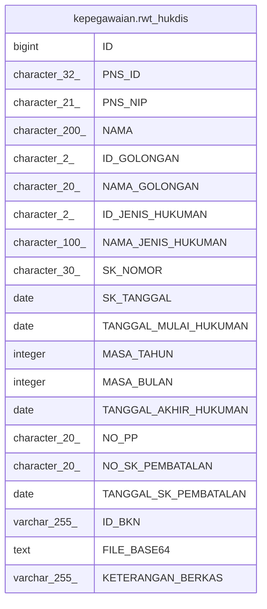

# kepegawaian.rwt_hukdis

## Description

## Columns

| Name | Type | Default | Nullable | Children | Parents | Comment |
| ---- | ---- | ------- | -------- | -------- | ------- | ------- |
| ID | bigint | nextval('kepegawaian."rwt_hukdis_ID_seq"'::regclass) | false |  |  |  |
| PNS_ID | character(32) |  | true |  |  |  |
| PNS_NIP | character(21) |  | true |  |  |  |
| NAMA | character(200) |  | true |  |  |  |
| ID_GOLONGAN | character(2) |  | true |  |  |  |
| NAMA_GOLONGAN | character(20) |  | true |  |  |  |
| ID_JENIS_HUKUMAN | character(2) |  | true |  |  |  |
| NAMA_JENIS_HUKUMAN | character(100) |  | true |  |  |  |
| SK_NOMOR | character(30) |  | true |  |  |  |
| SK_TANGGAL | date |  | true |  |  |  |
| TANGGAL_MULAI_HUKUMAN | date |  | true |  |  |  |
| MASA_TAHUN | integer |  | true |  |  |  |
| MASA_BULAN | integer |  | true |  |  |  |
| TANGGAL_AKHIR_HUKUMAN | date |  | true |  |  |  |
| NO_PP | character(20) |  | true |  |  |  |
| NO_SK_PEMBATALAN | character(20) |  | true |  |  |  |
| TANGGAL_SK_PEMBATALAN | date |  | true |  |  |  |
| ID_BKN | varchar(255) |  | true |  |  |  |
| FILE_BASE64 | text |  | true |  |  |  |
| KETERANGAN_BERKAS | varchar(255) |  | true |  |  |  |

## Relations

---

> Generated by [tbls](https://github.com/k1LoW/tbls)
