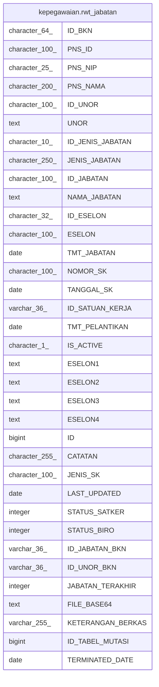

# kepegawaian.rwt_jabatan

## Description

## Columns

| Name | Type | Default | Nullable | Children | Parents | Comment |
| ---- | ---- | ------- | -------- | -------- | ------- | ------- |
| ID_BKN | character(64) |  | true |  |  |  |
| PNS_ID | character(100) |  | true |  |  |  |
| PNS_NIP | character(25) |  | true |  |  |  |
| PNS_NAMA | character(200) |  | true |  |  |  |
| ID_UNOR | character(100) |  | true |  |  |  |
| UNOR | text |  | true |  |  |  |
| ID_JENIS_JABATAN | character(10) |  | true |  |  |  |
| JENIS_JABATAN | character(250) |  | true |  |  |  |
| ID_JABATAN | character(100) |  | true |  |  |  |
| NAMA_JABATAN | text |  | true |  |  |  |
| ID_ESELON | character(32) |  | true |  |  |  |
| ESELON | character(100) |  | true |  |  |  |
| TMT_JABATAN | date |  | true |  |  |  |
| NOMOR_SK | character(100) |  | true |  |  |  |
| TANGGAL_SK | date |  | true |  |  |  |
| ID_SATUAN_KERJA | varchar(36) |  | true |  |  |  |
| TMT_PELANTIKAN | date |  | true |  |  |  |
| IS_ACTIVE | character(1) |  | true |  |  |  |
| ESELON1 | text |  | true |  |  |  |
| ESELON2 | text |  | true |  |  |  |
| ESELON3 | text |  | true |  |  |  |
| ESELON4 | text |  | true |  |  |  |
| ID | bigint | nextval('kepegawaian."rwt_jabatan_ID_seq"'::regclass) | false |  |  |  |
| CATATAN | character(255) |  | true |  |  |  |
| JENIS_SK | character(100) |  | true |  |  |  |
| LAST_UPDATED | date |  | true |  |  |  |
| STATUS_SATKER | integer |  | true |  |  |  |
| STATUS_BIRO | integer |  | true |  |  |  |
| ID_JABATAN_BKN | varchar(36) |  | true |  |  |  |
| ID_UNOR_BKN | varchar(36) |  | true |  |  |  |
| JABATAN_TERAKHIR | integer |  | true |  |  |  |
| FILE_BASE64 | text |  | true |  |  |  |
| KETERANGAN_BERKAS | varchar(255) |  | true |  |  |  |
| ID_TABEL_MUTASI | bigint |  | true |  |  |  |
| TERMINATED_DATE | date |  | true |  |  |  |

## Constraints

| Name | Type | Definition |
| ---- | ---- | ---------- |
| rwt_jabatan_pkey | PRIMARY KEY | PRIMARY KEY ("ID") |

## Indexes

| Name | Definition |
| ---- | ---------- |
| rwt_jabatan_pkey | CREATE UNIQUE INDEX rwt_jabatan_pkey ON kepegawaian.rwt_jabatan USING btree ("ID") |

## Relations

---

> Generated by [tbls](https://github.com/k1LoW/tbls)
