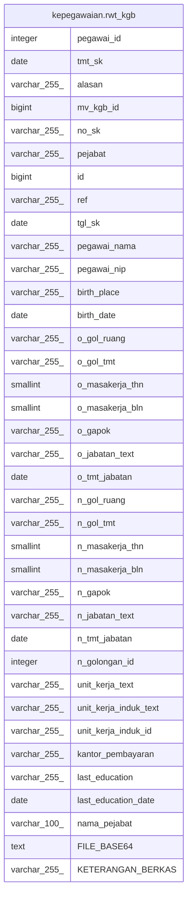

# kepegawaian.rwt_kgb

## Description

## Columns

| Name | Type | Default | Nullable | Children | Parents | Comment |
| ---- | ---- | ------- | -------- | -------- | ------- | ------- |
| pegawai_id | integer |  | true |  |  |  |
| tmt_sk | date |  | true |  |  |  |
| alasan | varchar(255) |  | true |  |  |  |
| mv_kgb_id | bigint |  | true |  |  |  |
| no_sk | varchar(255) |  | true |  |  |  |
| pejabat | varchar(255) |  | true |  |  |  |
| id | bigint | nextval('kepegawaian.rwt_kgb_id_seq'::regclass) | false |  |  |  |
| ref | varchar(255) | kepegawaian.uuid_generate_v4() | true |  |  |  |
| tgl_sk | date |  | true |  |  |  |
| pegawai_nama | varchar(255) |  | true |  |  |  |
| pegawai_nip | varchar(255) |  | true |  |  |  |
| birth_place | varchar(255) |  | true |  |  |  |
| birth_date | date |  | true |  |  |  |
| o_gol_ruang | varchar(255) |  | true |  |  |  |
| o_gol_tmt | varchar(255) |  | true |  |  |  |
| o_masakerja_thn | smallint |  | true |  |  |  |
| o_masakerja_bln | smallint |  | true |  |  |  |
| o_gapok | varchar(255) |  | true |  |  |  |
| o_jabatan_text | varchar(255) |  | true |  |  |  |
| o_tmt_jabatan | date |  | true |  |  |  |
| n_gol_ruang | varchar(255) |  | true |  |  |  |
| n_gol_tmt | varchar(255) |  | true |  |  |  |
| n_masakerja_thn | smallint |  | true |  |  |  |
| n_masakerja_bln | smallint |  | true |  |  |  |
| n_gapok | varchar(255) |  | true |  |  |  |
| n_jabatan_text | varchar(255) |  | true |  |  |  |
| n_tmt_jabatan | date |  | true |  |  |  |
| n_golongan_id | integer |  | true |  |  |  |
| unit_kerja_text | varchar(255) |  | true |  |  |  |
| unit_kerja_induk_text | varchar(255) |  | true |  |  |  |
| unit_kerja_induk_id | varchar(255) |  | true |  |  |  |
| kantor_pembayaran | varchar(255) |  | true |  |  |  |
| last_education | varchar(255) |  | true |  |  |  |
| last_education_date | date |  | true |  |  |  |
| nama_pejabat | varchar(100) |  | true |  |  |  |
| FILE_BASE64 | text |  | true |  |  |  |
| KETERANGAN_BERKAS | varchar(255) |  | true |  |  |  |

## Relations

---

> Generated by [tbls](https://github.com/k1LoW/tbls)
