# kepegawaian.rwt_kinerja

## Description

## Columns

| Name | Type | Default | Nullable | Children | Parents | Comment |
| ---- | ---- | ------- | -------- | -------- | ------- | ------- |
| id | integer | nextval('kepegawaian.rwt_kinerja_id_seq'::regclass) | false |  |  |  |
| id_simarin | integer |  | true |  |  |  |
| tahun | integer |  | true |  |  |  |
| periode_mulai | date |  | true |  |  |  |
| periode_selesai | date |  | true |  |  |  |
| format_skp | varchar(20) |  | true |  |  |  |
| jenis_skp | varchar(20) |  | true |  |  |  |
| idp_pegawai | varchar(7) |  | true |  |  |  |
| nip | varchar(20) |  | true |  |  |  |
| nama | varchar(200) |  | true |  |  |  |
| panggol | varchar(50) |  | true |  |  |  |
| jabatan | varchar(200) |  | true |  |  |  |
| penugasan | varchar(200) |  | true |  |  |  |
| id_unit_kerja | integer |  | true |  |  |  |
| unit_kerja | varchar(200) |  | true |  |  |  |
| idp_penilai | varchar(7) |  | true |  |  |  |
| nip_penilai | varchar(20) |  | true |  |  |  |
| nama_penilai | varchar(200) |  | true |  |  |  |
| panggol_penilai | varchar(50) |  | true |  |  |  |
| jabatan_penilai | varchar(200) |  | true |  |  |  |
| penugasan_penilai | varchar(200) |  | true |  |  |  |
| id_unit_kerja_penilai | integer |  | true |  |  |  |
| unit_kerja_penilai | varchar(200) |  | true |  |  |  |
| idp_atasan_penilai | varchar(7) |  | true |  |  |  |
| nip_atasan_penilai | varchar(20) |  | true |  |  |  |
| nama_atasan_penilai | varchar(200) |  | true |  |  |  |
| panggol_atasan_penilai | varchar(50) |  | true |  |  |  |
| jabatan_atasan_penilai | varchar(200) |  | true |  |  |  |
| penugasan_atasan_penilai | varchar(200) |  | true |  |  |  |
| id_unit_kerja_atasan_penilai | integer |  | true |  |  |  |
| unit_kerja_atasan_penilai | varchar(200) |  | true |  |  |  |
| idp_penilai_simarin | varchar(7) |  | true |  |  |  |
| nip_penilai_simarin | varchar(20) |  | true |  |  |  |
| nama_penilai_simarin | varchar(200) |  | true |  |  |  |
| panggol_penilai_simarin | varchar(50) |  | true |  |  |  |
| jabatan_penilai_simarin | varchar(200) |  | true |  |  |  |
| penugasan_penilai_simarin | varchar(200) |  | true |  |  |  |
| id_unit_kerja_penilai_simarin | integer |  | true |  |  |  |
| unit_kerja_penilai_simarin | varchar(200) |  | true |  |  |  |
| idp_penilai_realisasi | varchar(7) |  | true |  |  |  |
| nip_penilai_realisasi | varchar(20) |  | true |  |  |  |
| nama_penilai_realisasi | varchar(200) |  | true |  |  |  |
| panggol_penilai_realisasi | varchar(50) |  | true |  |  |  |
| jabatan_penilai_realisasi | varchar(200) |  | true |  |  |  |
| penugasan_penilai_realisasi | varchar(200) |  | true |  |  |  |
| id_unit_kerja_penilai_realisasi | integer |  | true |  |  |  |
| unit_kerja_penilai_realisasi | varchar(200) |  | true |  |  |  |
| idp_atasan_penilai_realisasi | varchar(7) |  | true |  |  |  |
| nip_atasan_penilai_realisasi | varchar(20) |  | true |  |  |  |
| nama_atasan_penilai_realisasi | varchar(200) |  | true |  |  |  |
| panggol_atasan_penilai_realisasi | varchar(50) |  | true |  |  |  |
| jabatan_atasan_penilai_realisasi | varchar(200) |  | true |  |  |  |
| penugasan_atasan_penilai_realisasi | varchar(200) |  | true |  |  |  |
| id_unit_kerja_atasan_penilai_realisasi | integer |  | true |  |  |  |
| unit_kerja_atasan_penilai_realisasi | varchar(200) |  | true |  |  |  |
| idp_penilai_realisasi_simarin | varchar(7) |  | true |  |  |  |
| nip_penilai_realisasi_simarin | varchar(20) |  | true |  |  |  |
| nama_penilai_realisasi_simarin | varchar(200) |  | true |  |  |  |
| panggol_penilai_realisasi_simarin | varchar(50) |  | true |  |  |  |
| jabatan_penilai_realisasi_simarin | varchar(200) |  | true |  |  |  |
| penugasan_penilai_realisasi_simarin | varchar(200) |  | true |  |  |  |
| id_unit_kerja_penilai_realisasi_simarin | integer |  | true |  |  |  |
| unit_kerja_penilai_realisasi_simarin | varchar(200) |  | true |  |  |  |
| nama_realisasi | varchar(200) |  | true |  |  |  |
| nip_realisasi | varchar(20) |  | true |  |  |  |
| panggol_realisasi | varchar(50) |  | true |  |  |  |
| jabatan_realisasi | varchar(200) |  | true |  |  |  |
| penugasan_realisasi | varchar(200) |  | true |  |  |  |
| id_unit_kerja_realisasi | integer |  | true |  |  |  |
| unit_kerja_realisasi | varchar(200) |  | true |  |  |  |
| skp_instansi_lama | varchar(200) |  | true |  |  |  |
| capaian_kinerja_org | varchar(20) |  | true |  |  |  |
| pola_distribusi_img | varchar(200) |  | true |  |  |  |
| nilai_akhir_hasil_kerja | real |  | true |  |  |  |
| rating_hasil_kerja | varchar(50) |  | true |  |  |  |
| nilai_akhir_perilaku_kerja | real |  | true |  |  |  |
| rating_perilaku_kerja | varchar(50) |  | true |  |  |  |
| predikat_kinerja | varchar(100) |  | true |  |  |  |
| tunjangan_kinerja | integer |  | true |  |  |  |
| catatan_rekomendasi | text |  | true |  |  |  |
| is_keberatan | varchar(100) |  | true |  |  |  |
| keberatan | text |  | true |  |  |  |
| penjelasan_pejabat_penilai | text |  | true |  |  |  |
| keputusan_rekomendasi_atasan_pejabat | text |  | true |  |  |  |
| url_skp_instansi_lama | varchar(200) |  | true |  |  |  |
| is_keberatan_date | varchar(5) |  | true |  |  |  |
| ref | uuid | kepegawaian.uuid_generate_v4() | true |  |  |  |
| id_arsip | integer |  | true |  |  |  |
| created_date | timestamp(6) without time zone | now() | true |  |  |  |

## Relations

```mermaid
erDiagram


"kepegawaian.rwt_kinerja" {
  integer id
  integer id_simarin
  integer tahun
  date periode_mulai
  date periode_selesai
  varchar_20_ format_skp
  varchar_20_ jenis_skp
  varchar_7_ idp_pegawai
  varchar_20_ nip
  varchar_200_ nama
  varchar_50_ panggol
  varchar_200_ jabatan
  varchar_200_ penugasan
  integer id_unit_kerja
  varchar_200_ unit_kerja
  varchar_7_ idp_penilai
  varchar_20_ nip_penilai
  varchar_200_ nama_penilai
  varchar_50_ panggol_penilai
  varchar_200_ jabatan_penilai
  varchar_200_ penugasan_penilai
  integer id_unit_kerja_penilai
  varchar_200_ unit_kerja_penilai
  varchar_7_ idp_atasan_penilai
  varchar_20_ nip_atasan_penilai
  varchar_200_ nama_atasan_penilai
  varchar_50_ panggol_atasan_penilai
  varchar_200_ jabatan_atasan_penilai
  varchar_200_ penugasan_atasan_penilai
  integer id_unit_kerja_atasan_penilai
  varchar_200_ unit_kerja_atasan_penilai
  varchar_7_ idp_penilai_simarin
  varchar_20_ nip_penilai_simarin
  varchar_200_ nama_penilai_simarin
  varchar_50_ panggol_penilai_simarin
  varchar_200_ jabatan_penilai_simarin
  varchar_200_ penugasan_penilai_simarin
  integer id_unit_kerja_penilai_simarin
  varchar_200_ unit_kerja_penilai_simarin
  varchar_7_ idp_penilai_realisasi
  varchar_20_ nip_penilai_realisasi
  varchar_200_ nama_penilai_realisasi
  varchar_50_ panggol_penilai_realisasi
  varchar_200_ jabatan_penilai_realisasi
  varchar_200_ penugasan_penilai_realisasi
  integer id_unit_kerja_penilai_realisasi
  varchar_200_ unit_kerja_penilai_realisasi
  varchar_7_ idp_atasan_penilai_realisasi
  varchar_20_ nip_atasan_penilai_realisasi
  varchar_200_ nama_atasan_penilai_realisasi
  varchar_50_ panggol_atasan_penilai_realisasi
  varchar_200_ jabatan_atasan_penilai_realisasi
  varchar_200_ penugasan_atasan_penilai_realisasi
  integer id_unit_kerja_atasan_penilai_realisasi
  varchar_200_ unit_kerja_atasan_penilai_realisasi
  varchar_7_ idp_penilai_realisasi_simarin
  varchar_20_ nip_penilai_realisasi_simarin
  varchar_200_ nama_penilai_realisasi_simarin
  varchar_50_ panggol_penilai_realisasi_simarin
  varchar_200_ jabatan_penilai_realisasi_simarin
  varchar_200_ penugasan_penilai_realisasi_simarin
  integer id_unit_kerja_penilai_realisasi_simarin
  varchar_200_ unit_kerja_penilai_realisasi_simarin
  varchar_200_ nama_realisasi
  varchar_20_ nip_realisasi
  varchar_50_ panggol_realisasi
  varchar_200_ jabatan_realisasi
  varchar_200_ penugasan_realisasi
  integer id_unit_kerja_realisasi
  varchar_200_ unit_kerja_realisasi
  varchar_200_ skp_instansi_lama
  varchar_20_ capaian_kinerja_org
  varchar_200_ pola_distribusi_img
  real nilai_akhir_hasil_kerja
  varchar_50_ rating_hasil_kerja
  real nilai_akhir_perilaku_kerja
  varchar_50_ rating_perilaku_kerja
  varchar_100_ predikat_kinerja
  integer tunjangan_kinerja
  text catatan_rekomendasi
  varchar_100_ is_keberatan
  text keberatan
  text penjelasan_pejabat_penilai
  text keputusan_rekomendasi_atasan_pejabat
  varchar_200_ url_skp_instansi_lama
  varchar_5_ is_keberatan_date
  uuid ref
  integer id_arsip
  timestamp_6__without_time_zone created_date
}
```

---

> Generated by [tbls](https://github.com/k1LoW/tbls)
