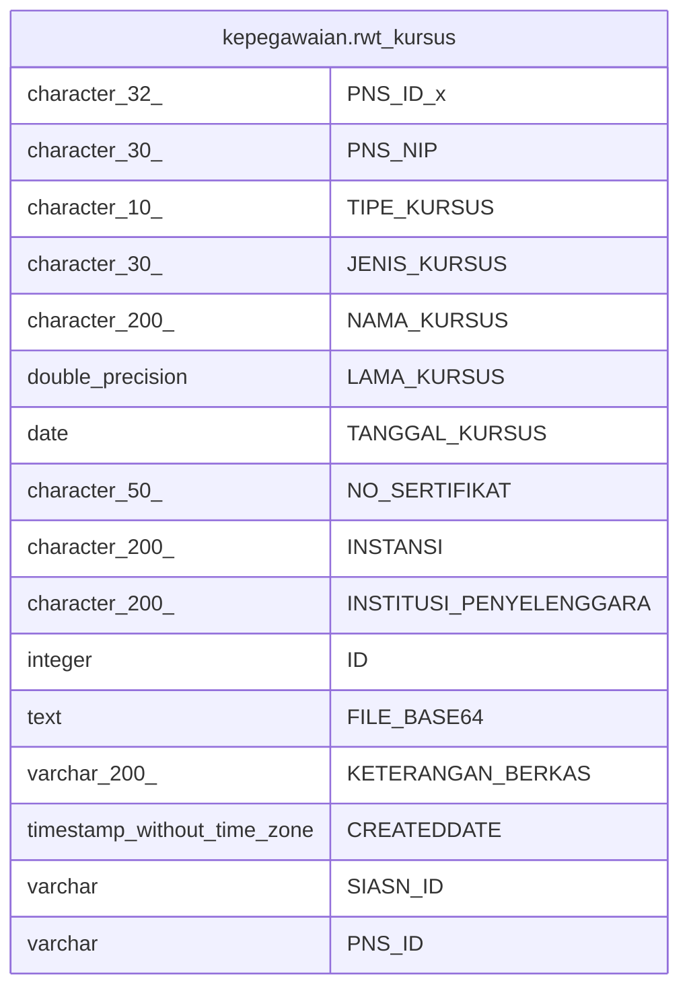

# kepegawaian.rwt_kursus

## Description

## Columns

| Name | Type | Default | Nullable | Children | Parents | Comment |
| ---- | ---- | ------- | -------- | -------- | ------- | ------- |
| PNS_ID_x | character(32) |  | true |  |  |  |
| PNS_NIP | character(30) |  | true |  |  |  |
| TIPE_KURSUS | character(10) |  | true |  |  |  |
| JENIS_KURSUS | character(30) |  | true |  |  |  |
| NAMA_KURSUS | character(200) |  | true |  |  |  |
| LAMA_KURSUS | double precision |  | true |  |  |  |
| TANGGAL_KURSUS | date |  | true |  |  |  |
| NO_SERTIFIKAT | character(50) |  | true |  |  |  |
| INSTANSI | character(200) |  | true |  |  |  |
| INSTITUSI_PENYELENGGARA | character(200) |  | true |  |  |  |
| ID | integer | nextval('kepegawaian."rwt_kursus_ID_seq"'::regclass) | false |  |  |  |
| FILE_BASE64 | text |  | true |  |  |  |
| KETERANGAN_BERKAS | varchar(200) |  | true |  |  |  |
| CREATEDDATE | timestamp without time zone | now() | true |  |  |  |
| SIASN_ID | varchar |  | true |  |  |  |
| PNS_ID | varchar |  | true |  |  |  |

## Relations

---

> Generated by [tbls](https://github.com/k1LoW/tbls)
