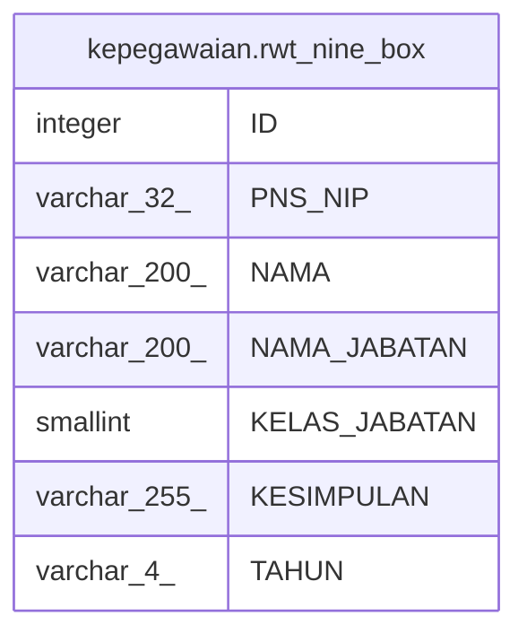

# kepegawaian.rwt_nine_box

## Description

## Columns

| Name | Type | Default | Nullable | Children | Parents | Comment |
| ---- | ---- | ------- | -------- | -------- | ------- | ------- |
| ID | integer | nextval('kepegawaian."NINE_BOX_ID_seq"'::regclass) | false |  |  |  |
| PNS_NIP | varchar(32) |  | true |  |  |  |
| NAMA | varchar(200) |  | true |  |  |  |
| NAMA_JABATAN | varchar(200) |  | true |  |  |  |
| KELAS_JABATAN | smallint |  | true |  |  |  |
| KESIMPULAN | varchar(255) |  | true |  |  |  |
| TAHUN | varchar(4) |  | true |  |  |  |

## Constraints

| Name | Type | Definition |
| ---- | ---- | ---------- |
| NINE_BOX_pkey | PRIMARY KEY | PRIMARY KEY ("ID") |

## Indexes

| Name | Definition |
| ---- | ---------- |
| NINE_BOX_pkey | CREATE UNIQUE INDEX "NINE_BOX_pkey" ON kepegawaian.rwt_nine_box USING btree ("ID") |

## Relations

---

> Generated by [tbls](https://github.com/k1LoW/tbls)
