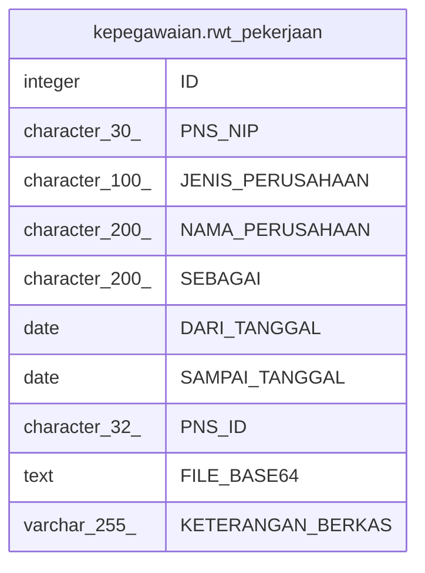

# kepegawaian.rwt_pekerjaan

## Description

## Columns

| Name | Type | Default | Nullable | Children | Parents | Comment |
| ---- | ---- | ------- | -------- | -------- | ------- | ------- |
| ID | integer | nextval('kepegawaian."rwt_pekerjaan_ID_seq"'::regclass) | false |  |  |  |
| PNS_NIP | character(30) |  | true |  |  |  |
| JENIS_PERUSAHAAN | character(100) |  | true |  |  |  |
| NAMA_PERUSAHAAN | character(200) |  | true |  |  |  |
| SEBAGAI | character(200) |  | true |  |  |  |
| DARI_TANGGAL | date |  | true |  |  |  |
| SAMPAI_TANGGAL | date |  | true |  |  |  |
| PNS_ID | character(32) |  | true |  |  |  |
| FILE_BASE64 | text |  | true |  |  |  |
| KETERANGAN_BERKAS | varchar(255) |  | true |  |  |  |

## Constraints

| Name | Type | Definition |
| ---- | ---- | ---------- |
| rwt_pekerjaan_pkey | PRIMARY KEY | PRIMARY KEY ("ID") |

## Indexes

| Name | Definition |
| ---- | ---------- |
| rwt_pekerjaan_pkey | CREATE UNIQUE INDEX rwt_pekerjaan_pkey ON kepegawaian.rwt_pekerjaan USING btree ("ID") |

## Relations

---

> Generated by [tbls](https://github.com/k1LoW/tbls)
