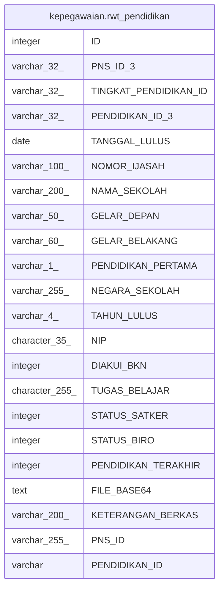

# kepegawaian.rwt_pendidikan

## Description

## Columns

| Name | Type | Default | Nullable | Children | Parents | Comment |
| ---- | ---- | ------- | -------- | -------- | ------- | ------- |
| ID | integer | nextval('kepegawaian."rwt_pendidikan_ID_seq"'::regclass) | false |  |  |  |
| PNS_ID_3 | varchar(32) |  | true |  |  |  |
| TINGKAT_PENDIDIKAN_ID | varchar(32) |  | true |  |  |  |
| PENDIDIKAN_ID_3 | varchar(32) |  | true |  |  |  |
| TANGGAL_LULUS | date |  | true |  |  |  |
| NOMOR_IJASAH | varchar(100) |  | true |  |  |  |
| NAMA_SEKOLAH | varchar(200) |  | true |  |  |  |
| GELAR_DEPAN | varchar(50) |  | true |  |  |  |
| GELAR_BELAKANG | varchar(60) |  | true |  |  |  |
| PENDIDIKAN_PERTAMA | varchar(1) |  | true |  |  |  |
| NEGARA_SEKOLAH | varchar(255) |  | true |  |  |  |
| TAHUN_LULUS | varchar(4) |  | true |  |  |  |
| NIP | character(35) |  | true |  |  |  |
| DIAKUI_BKN | integer |  | true |  |  |  |
| TUGAS_BELAJAR | character(255) |  | true |  |  |  |
| STATUS_SATKER | integer |  | true |  |  |  |
| STATUS_BIRO | integer |  | true |  |  |  |
| PENDIDIKAN_TERAKHIR | integer |  | true |  |  |  |
| FILE_BASE64 | text |  | true |  |  |  |
| KETERANGAN_BERKAS | varchar(200) |  | true |  |  |  |
| PNS_ID | varchar(255) |  | false |  |  |  |
| PENDIDIKAN_ID | varchar |  | true |  |  |  |

## Constraints

| Name | Type | Definition |
| ---- | ---- | ---------- |
| rwt_pendidikan_pkey | PRIMARY KEY | PRIMARY KEY ("ID") |

## Indexes

| Name | Definition |
| ---- | ---------- |
| rwt_pendidikan_pkey | CREATE UNIQUE INDEX rwt_pendidikan_pkey ON kepegawaian.rwt_pendidikan USING btree ("ID") |

## Relations

---

> Generated by [tbls](https://github.com/k1LoW/tbls)
