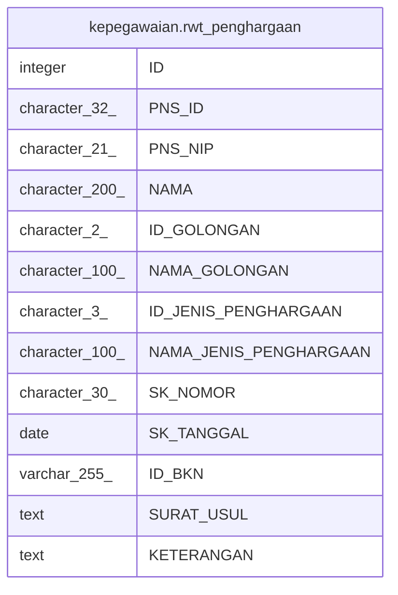

# kepegawaian.rwt_penghargaan

## Description

## Columns

| Name | Type | Default | Nullable | Children | Parents | Comment |
| ---- | ---- | ------- | -------- | -------- | ------- | ------- |
| ID | integer | nextval('kepegawaian."rwt_penghargaan_ID_seq"'::regclass) | false |  |  |  |
| PNS_ID | character(32) |  | true |  |  |  |
| PNS_NIP | character(21) |  | true |  |  |  |
| NAMA | character(200) |  | true |  |  |  |
| ID_GOLONGAN | character(2) |  | true |  |  |  |
| NAMA_GOLONGAN | character(100) |  | true |  |  |  |
| ID_JENIS_PENGHARGAAN | character(3) |  | true |  |  |  |
| NAMA_JENIS_PENGHARGAAN | character(100) |  | true |  |  |  |
| SK_NOMOR | character(30) |  | true |  |  |  |
| SK_TANGGAL | date |  | true |  |  |  |
| ID_BKN | varchar(255) |  | true |  |  |  |
| SURAT_USUL | text |  | true |  |  |  |
| KETERANGAN | text |  | true |  |  |  |

## Constraints

| Name | Type | Definition |
| ---- | ---- | ---------- |
| rwt_penghargaan_ID | PRIMARY KEY | PRIMARY KEY ("ID") |

## Indexes

| Name | Definition |
| ---- | ---------- |
| rwt_penghargaan_ID | CREATE UNIQUE INDEX "rwt_penghargaan_ID" ON kepegawaian.rwt_penghargaan USING btree ("ID") |
| rwt_penghargaan_ID_GOLONGAN | CREATE INDEX "rwt_penghargaan_ID_GOLONGAN" ON kepegawaian.rwt_penghargaan USING btree ("ID_GOLONGAN") |
| rwt_penghargaan_ID_PENGHARGAAN | CREATE INDEX "rwt_penghargaan_ID_PENGHARGAAN" ON kepegawaian.rwt_penghargaan USING btree ("ID_JENIS_PENGHARGAAN") |
| rwt_penghargaan_PNS_ID | CREATE INDEX "rwt_penghargaan_PNS_ID" ON kepegawaian.rwt_penghargaan USING btree ("PNS_ID") |
| rwt_penghargaan_PNS_NIP | CREATE INDEX "rwt_penghargaan_PNS_NIP" ON kepegawaian.rwt_penghargaan USING btree ("PNS_NIP") |

## Relations

---

> Generated by [tbls](https://github.com/k1LoW/tbls)
