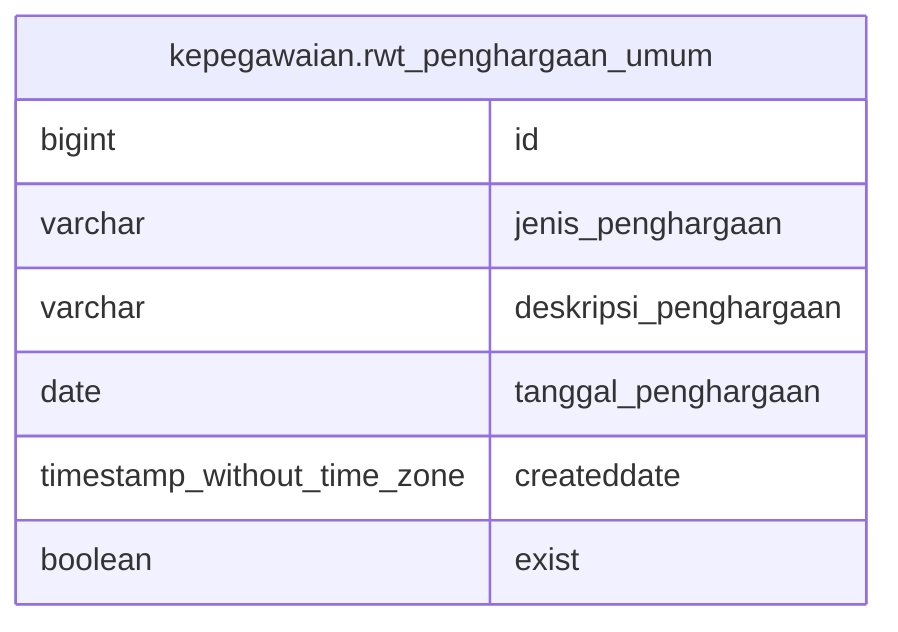

# kepegawaian.rwt_penghargaan_umum

## Description

## Columns

| Name | Type | Default | Nullable | Children | Parents | Comment |
| ---- | ---- | ------- | -------- | -------- | ------- | ------- |
| id | bigint | nextval('kepegawaian.rwt_penghargaan_umum_id_seq'::regclass) | false |  |  |  |
| jenis_penghargaan | varchar |  | true |  |  |  |
| deskripsi_penghargaan | varchar |  | true |  |  |  |
| tanggal_penghargaan | date |  | true |  |  |  |
| createddate | timestamp without time zone | now() | true |  |  |  |
| exist | boolean | true | true |  |  |  |

## Constraints

| Name | Type | Definition |
| ---- | ---- | ---------- |
| rwt_penghargaan_umum_pkey | PRIMARY KEY | PRIMARY KEY (id) |

## Indexes

| Name | Definition |
| ---- | ---------- |
| rwt_penghargaan_umum_pkey | CREATE UNIQUE INDEX rwt_penghargaan_umum_pkey ON kepegawaian.rwt_penghargaan_umum USING btree (id) |

## Relations

---

> Generated by [tbls](https://github.com/k1LoW/tbls)
