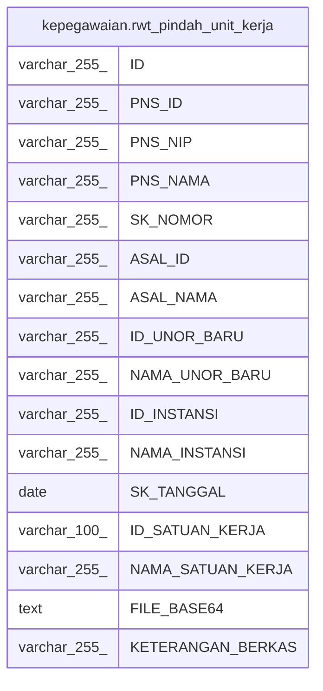

# kepegawaian.rwt_pindah_unit_kerja

## Description

## Columns

| Name | Type | Default | Nullable | Children | Parents | Comment |
| ---- | ---- | ------- | -------- | -------- | ------- | ------- |
| ID | varchar(255) | nextval('kepegawaian.rwt_pindah_unit_kerja_id_seq'::regclass) | false |  |  |  |
| PNS_ID | varchar(255) |  | true |  |  |  |
| PNS_NIP | varchar(255) |  | true |  |  |  |
| PNS_NAMA | varchar(255) |  | true |  |  |  |
| SK_NOMOR | varchar(255) |  | true |  |  |  |
| ASAL_ID | varchar(255) |  | true |  |  |  |
| ASAL_NAMA | varchar(255) |  | true |  |  |  |
| ID_UNOR_BARU | varchar(255) |  | true |  |  |  |
| NAMA_UNOR_BARU | varchar(255) |  | true |  |  |  |
| ID_INSTANSI | varchar(255) |  | true |  |  |  |
| NAMA_INSTANSI | varchar(255) |  | true |  |  |  |
| SK_TANGGAL | date |  | true |  |  |  |
| ID_SATUAN_KERJA | varchar(100) |  | true |  |  |  |
| NAMA_SATUAN_KERJA | varchar(255) |  | true |  |  |  |
| FILE_BASE64 | text |  | true |  |  |  |
| KETERANGAN_BERKAS | varchar(255) |  | true |  |  |  |

## Constraints

| Name | Type | Definition |
| ---- | ---- | ---------- |
| rwt_pindah_unit_kerja_pkey | PRIMARY KEY | PRIMARY KEY ("ID") |

## Indexes

| Name | Definition |
| ---- | ---------- |
| rwt_pindah_unit_kerja_pkey | CREATE UNIQUE INDEX rwt_pindah_unit_kerja_pkey ON kepegawaian.rwt_pindah_unit_kerja USING btree ("ID") |

## Relations

---

> Generated by [tbls](https://github.com/k1LoW/tbls)
