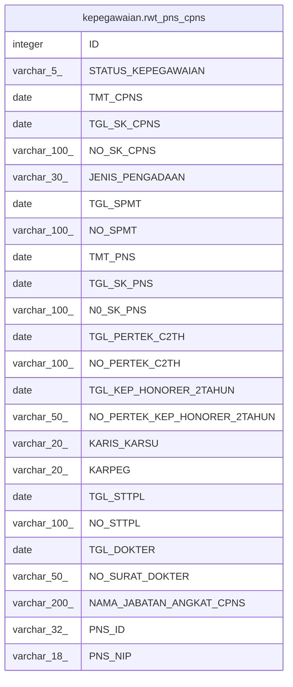

# kepegawaian.rwt_pns_cpns

## Description

## Columns

| Name | Type | Default | Nullable | Children | Parents | Comment |
| ---- | ---- | ------- | -------- | -------- | ------- | ------- |
| ID | integer | nextval('kepegawaian."rwt_pns_cpns_ID_seq"'::regclass) | false |  |  |  |
| STATUS_KEPEGAWAIAN | varchar(5) |  | true |  |  |  |
| TMT_CPNS | date |  | true |  |  |  |
| TGL_SK_CPNS | date |  | true |  |  |  |
| NO_SK_CPNS | varchar(100) |  | true |  |  |  |
| JENIS_PENGADAAN | varchar(30) |  | true |  |  |  |
| TGL_SPMT | date |  | true |  |  |  |
| NO_SPMT | varchar(100) |  | true |  |  |  |
| TMT_PNS | date |  | true |  |  |  |
| TGL_SK_PNS | date |  | true |  |  |  |
| N0_SK_PNS | varchar(100) |  | true |  |  |  |
| TGL_PERTEK_C2TH | date |  | true |  |  |  |
| NO_PERTEK_C2TH | varchar(100) |  | true |  |  |  |
| TGL_KEP_HONORER_2TAHUN | date |  | true |  |  |  |
| NO_PERTEK_KEP_HONORER_2TAHUN | varchar(50) |  | true |  |  |  |
| KARIS_KARSU | varchar(20) |  | true |  |  |  |
| KARPEG | varchar(20) |  | true |  |  |  |
| TGL_STTPL | date |  | true |  |  |  |
| NO_STTPL | varchar(100) |  | true |  |  |  |
| TGL_DOKTER | date |  | true |  |  |  |
| NO_SURAT_DOKTER | varchar(50) |  | true |  |  |  |
| NAMA_JABATAN_ANGKAT_CPNS | varchar(200) |  | true |  |  |  |
| PNS_ID | varchar(32) |  | true |  |  |  |
| PNS_NIP | varchar(18) |  | true |  |  |  |

## Constraints

| Name | Type | Definition |
| ---- | ---- | ---------- |
| rwt_pns_cpns_pkey | PRIMARY KEY | PRIMARY KEY ("ID") |

## Indexes

| Name | Definition |
| ---- | ---------- |
| rwt_pns_cpns_pkey | CREATE UNIQUE INDEX rwt_pns_cpns_pkey ON kepegawaian.rwt_pns_cpns USING btree ("ID") |

## Relations

---

> Generated by [tbls](https://github.com/k1LoW/tbls)
