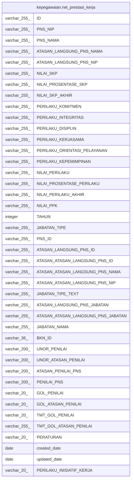

# kepegawaian.rwt_prestasi_kerja

## Description

## Columns

| Name | Type | Default | Nullable | Children | Parents | Comment |
| ---- | ---- | ------- | -------- | -------- | ------- | ------- |
| ID | varchar(255) | nextval('kepegawaian.rwt_prestasi_kerja_id_seq'::regclass) | false |  |  |  |
| PNS_NIP | varchar(255) |  | true |  |  |  |
| PNS_NAMA | varchar(255) |  | true |  |  |  |
| ATASAN_LANGSUNG_PNS_NAMA | varchar(255) |  | true |  |  |  |
| ATASAN_LANGSUNG_PNS_NIP | varchar(255) |  | true |  |  |  |
| NILAI_SKP | varchar(255) |  | true |  |  |  |
| NILAI_PROSENTASE_SKP | varchar(255) |  | true |  |  |  |
| NILAI_SKP_AKHIR | varchar(255) |  | true |  |  |  |
| PERILAKU_KOMITMEN | varchar(255) |  | true |  |  |  |
| PERILAKU_INTEGRITAS | varchar(255) |  | true |  |  |  |
| PERILAKU_DISIPLIN | varchar(255) |  | true |  |  |  |
| PERILAKU_KERJASAMA | varchar(255) |  | true |  |  |  |
| PERILAKU_ORIENTASI_PELAYANAN | varchar(255) |  | true |  |  |  |
| PERILAKU_KEPEMIMPINAN | varchar(255) |  | true |  |  |  |
| NILAI_PERILAKU | varchar(255) |  | true |  |  |  |
| NILAI_PROSENTASE_PERILAKU | varchar(255) |  | true |  |  |  |
| NILAI_PERILAKU_AKHIR | varchar(255) |  | true |  |  |  |
| NILAI_PPK | varchar(255) |  | true |  |  |  |
| TAHUN | integer |  | true |  |  |  |
| JABATAN_TIPE | varchar(255) |  | true |  |  |  |
| PNS_ID | varchar(255) |  | true |  |  |  |
| ATASAN_LANGSUNG_PNS_ID | varchar(255) |  | true |  |  |  |
| ATASAN_ATASAN_LANGSUNG_PNS_ID | varchar(255) |  | true |  |  |  |
| ATASAN_ATASAN_LANGSUNG_PNS_NAMA | varchar(255) |  | true |  |  |  |
| ATASAN_ATASAN_LANGSUNG_PNS_NIP | varchar(255) |  | true |  |  |  |
| JABATAN_TIPE_TEXT | varchar(255) |  | true |  |  |  |
| ATASAN_LANGSUNG_PNS_JABATAN | varchar(255) |  | true |  |  |  |
| ATASAN_ATASAN_LANGSUNG_PNS_JABATAN | varchar(255) |  | true |  |  |  |
| JABATAN_NAMA | varchar(255) |  | true |  |  |  |
| BKN_ID | varchar(36) |  | true |  |  |  |
| UNOR_PENILAI | varchar(200) |  | true |  |  |  |
| UNOR_ATASAN_PENILAI | varchar(200) |  | true |  |  |  |
| ATASAN_PENILAI_PNS | varchar(200) |  | true |  |  |  |
| PENILAI_PNS | varchar(200) |  | true |  |  |  |
| GOL_PENILAI | varchar(20) |  | true |  |  |  |
| GOL_ATASAN_PENILAI | varchar(20) |  | true |  |  |  |
| TMT_GOL_PENILAI | varchar(20) |  | true |  |  |  |
| TMT_GOL_ATASAN_PENILAI | varchar(255) |  | true |  |  |  |
| PERATURAN | varchar(20) |  | true |  |  |  |
| created_date | date |  | true |  |  |  |
| updated_date | date |  | true |  |  |  |
| PERILAKU_INISIATIF_KERJA | varchar(20) |  | true |  |  |  |

## Constraints

| Name | Type | Definition |
| ---- | ---- | ---------- |
| rwt_prestasi_kerja_pkey | PRIMARY KEY | PRIMARY KEY ("ID") |

## Indexes

| Name | Definition |
| ---- | ---------- |
| rwt_prestasi_kerja_pkey | CREATE UNIQUE INDEX rwt_prestasi_kerja_pkey ON kepegawaian.rwt_prestasi_kerja USING btree ("ID") |

## Relations

---

> Generated by [tbls](https://github.com/k1LoW/tbls)
