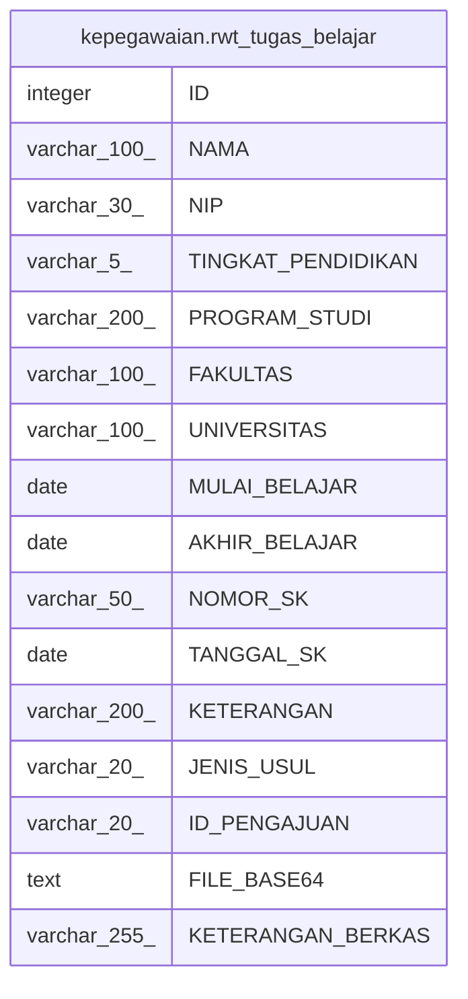

# kepegawaian.rwt_tugas_belajar

## Description

## Columns

| Name | Type | Default | Nullable | Children | Parents | Comment |
| ---- | ---- | ------- | -------- | -------- | ------- | ------- |
| ID | integer | nextval('kepegawaian."rwt_tugas_belajar_ID_seq"'::regclass) | false |  |  |  |
| NAMA | varchar(100) |  | true |  |  |  |
| NIP | varchar(30) |  | true |  |  |  |
| TINGKAT_PENDIDIKAN | varchar(5) |  | true |  |  |  |
| PROGRAM_STUDI | varchar(200) |  | true |  |  |  |
| FAKULTAS | varchar(100) |  | true |  |  |  |
| UNIVERSITAS | varchar(100) |  | true |  |  |  |
| MULAI_BELAJAR | date |  | true |  |  |  |
| AKHIR_BELAJAR | date |  | true |  |  |  |
| NOMOR_SK | varchar(50) |  | true |  |  |  |
| TANGGAL_SK | date |  | true |  |  |  |
| KETERANGAN | varchar(200) |  | true |  |  |  |
| JENIS_USUL | varchar(20) |  | true |  |  |  |
| ID_PENGAJUAN | varchar(20) |  | true |  |  |  |
| FILE_BASE64 | text |  | true |  |  |  |
| KETERANGAN_BERKAS | varchar(255) |  | true |  |  |  |

## Constraints

| Name | Type | Definition |
| ---- | ---- | ---------- |
| rwt_tugas_belajar_pkey | PRIMARY KEY | PRIMARY KEY ("ID") |

## Indexes

| Name | Definition |
| ---- | ---------- |
| rwt_tugas_belajar_pkey | CREATE UNIQUE INDEX rwt_tugas_belajar_pkey ON kepegawaian.rwt_tugas_belajar USING btree ("ID") |

## Relations

---

> Generated by [tbls](https://github.com/k1LoW/tbls)
