# kepegawaian.s3_files

## Description

## Columns

| Name | Type | Default | Nullable | Children | Parents | Comment |
| ---- | ---- | ------- | -------- | -------- | ------- | ------- |
| id | bigint | nextval('s3_files_id_seq'::regclass) | false | [kepegawaian.riwayat_diklat](kepegawaian.riwayat_diklat.md) [kepegawaian.riwayat_diklat_fungsional](kepegawaian.riwayat_diklat_fungsional.md) [kepegawaian.riwayat_diklat_struktural](kepegawaian.riwayat_diklat_struktural.md) [kepegawaian.riwayat_golongan](kepegawaian.riwayat_golongan.md) [kepegawaian.riwayat_hukuman_disiplin](kepegawaian.riwayat_hukuman_disiplin.md) [kepegawaian.riwayat_jabatan](kepegawaian.riwayat_jabatan.md) [kepegawaian.riwayat_kenaikan_gaji_berkala](kepegawaian.riwayat_kenaikan_gaji_berkala.md) [kepegawaian.riwayat_kursus](kepegawaian.riwayat_kursus.md) [kepegawaian.riwayat_pendidikan](kepegawaian.riwayat_pendidikan.md) [kepegawaian.riwayat_penghargaan_umum](kepegawaian.riwayat_penghargaan_umum.md) [kepegawaian.riwayat_pindah_unit_kerja](kepegawaian.riwayat_pindah_unit_kerja.md) [kepegawaian.riwayat_sertifikasi](kepegawaian.riwayat_sertifikasi.md) [kepegawaian.riwayat_penugasan](kepegawaian.riwayat_penugasan.md) [kepegawaian.surat_keputusan](kepegawaian.surat_keputusan.md) |  |  |
| object_bucket | text |  | true |  |  |  |
| object_key | text |  | true |  |  |  |
| created_at | timestamp with time zone | now() | true |  |  |  |
| updated_at | timestamp with time zone | now() | true |  |  |  |
| deleted_at | timestamp with time zone |  | true |  |  |  |

## Constraints

| Name | Type | Definition |
| ---- | ---- | ---------- |
| s3_files_pkey | PRIMARY KEY | PRIMARY KEY (id) |

## Indexes

| Name | Definition |
| ---- | ---------- |
| s3_files_pkey | CREATE UNIQUE INDEX s3_files_pkey ON kepegawaian.s3_files USING btree (id) |

## Relations

```mermaid
erDiagram

"kepegawaian.riwayat_diklat" }o--o| "kepegawaian.s3_files" : "FOREIGN KEY (s3_file_id) REFERENCES s3_files(id)"
"kepegawaian.riwayat_diklat_fungsional" }o--o| "kepegawaian.s3_files" : "FOREIGN KEY (s3_file_id) REFERENCES s3_files(id)"
"kepegawaian.riwayat_diklat_struktural" }o--o| "kepegawaian.s3_files" : "FOREIGN KEY (s3_file_id) REFERENCES s3_files(id)"
"kepegawaian.riwayat_golongan" }o--o| "kepegawaian.s3_files" : "FOREIGN KEY (s3_file_id) REFERENCES s3_files(id)"
"kepegawaian.riwayat_hukuman_disiplin" }o--o| "kepegawaian.s3_files" : "FOREIGN KEY (s3_file_id) REFERENCES s3_files(id)"
"kepegawaian.riwayat_jabatan" }o--o| "kepegawaian.s3_files" : "FOREIGN KEY (s3_file_id) REFERENCES s3_files(id)"
"kepegawaian.riwayat_kenaikan_gaji_berkala" }o--o| "kepegawaian.s3_files" : "FOREIGN KEY (s3_file_id) REFERENCES s3_files(id)"
"kepegawaian.riwayat_kursus" }o--o| "kepegawaian.s3_files" : "FOREIGN KEY (s3_file_id) REFERENCES s3_files(id)"
"kepegawaian.riwayat_pendidikan" }o--o| "kepegawaian.s3_files" : "FOREIGN KEY (s3_file_id) REFERENCES s3_files(id)"
"kepegawaian.riwayat_penghargaan_umum" }o--o| "kepegawaian.s3_files" : "FOREIGN KEY (s3_file_id) REFERENCES s3_files(id)"
"kepegawaian.riwayat_pindah_unit_kerja" }o--o| "kepegawaian.s3_files" : "FOREIGN KEY (s3_file_id) REFERENCES s3_files(id)"
"kepegawaian.riwayat_sertifikasi" }o--o| "kepegawaian.s3_files" : "FOREIGN KEY (s3_file_id) REFERENCES s3_files(id)"
"kepegawaian.riwayat_penugasan" }o--o| "kepegawaian.s3_files" : "FOREIGN KEY (s3_file_id) REFERENCES s3_files(id)"
"kepegawaian.surat_keputusan" }o--o| "kepegawaian.s3_files" : "FOREIGN KEY (s3_file_id) REFERENCES s3_files(id)"
"kepegawaian.surat_keputusan" }o--o| "kepegawaian.s3_files" : "FOREIGN KEY (s3_file_sign_id) REFERENCES s3_files(id)"

"kepegawaian.s3_files" {
  bigint id
  text object_bucket
  text object_key
  timestamp_with_time_zone created_at
  timestamp_with_time_zone updated_at
  timestamp_with_time_zone deleted_at
}
"kepegawaian.riwayat_diklat" {
  bigint id
  varchar_200_ jenis_diklat
  smallint jenis_diklat_id FK
  varchar_600_ institusi_penyelenggara
  varchar_600_ no_sertifikat
  date tanggal_mulai
  date tanggal_selesai
  integer tahun_diklat
  integer durasi_jam
  varchar_36_ pns_orang_id FK
  varchar_20_ nip_baru
  varchar_36_ diklat_struktural_id
  varchar_700_ nama_diklat
  text file_base64
  varchar_200_ rumpun_diklat_nama
  varchar_36_ rumpun_diklat_id
  varchar_10_ sudah_kirim_siasn
  varchar_36_ bkn_id
  timestamp_with_time_zone created_at
  timestamp_with_time_zone updated_at
  timestamp_with_time_zone deleted_at
  bigint s3_file_id FK
}
"kepegawaian.riwayat_diklat_fungsional" {
  varchar_36_ id
  varchar_20_ nip_baru
  varchar_9_ nip_lama
  varchar_200_ jenis_diklat
  varchar_300_ nama_kursus
  integer jumlah_jam
  smallint tahun
  varchar_300_ institusi_penyelenggara
  varchar_1_ jenis_kursus_sertifikat
  varchar_200_ no_sertifikat
  varchar_300_ instansi
  varchar_50_ status_data
  date tanggal_kursus
  text file_base64
  varchar_300_ keterangan_berkas
  real lama
  varchar_36_ siasn_id
  timestamp_with_time_zone created_at
  timestamp_with_time_zone updated_at
  timestamp_with_time_zone deleted_at
  bigint s3_file_id FK
}
"kepegawaian.riwayat_diklat_struktural" {
  varchar_36_ id
  varchar_36_ pns_id FK
  varchar_20_ pns_nip
  varchar_100_ pns_nama
  integer jenis_diklat_id FK
  varchar_200_ nama_diklat
  varchar_300_ nomor
  date tanggal
  smallint tahun
  varchar_10_ status_data
  text file_base64
  varchar_200_ keterangan_berkas
  real lama
  varchar_36_ siasn_id
  timestamp_with_time_zone created_at
  timestamp_with_time_zone updated_at
  timestamp_with_time_zone deleted_at
  bigint s3_file_id FK
}
"kepegawaian.riwayat_golongan" {
  varchar_36_ id
  varchar_36_ pns_id FK
  varchar_20_ pns_nip
  varchar_100_ pns_nama
  varchar_4_ kode_jenis_kp
  varchar_100_ jenis_kp
  smallint golongan_id FK
  varchar_10_ golongan_nama
  varchar_100_ pangkat_nama
  varchar_100_ sk_nomor
  varchar_100_ no_bkn
  integer jumlah_angka_kredit_utama
  integer jumlah_angka_kredit_tambahan
  smallint mk_golongan_tahun
  smallint mk_golongan_bulan
  date sk_tanggal
  date tanggal_bkn
  date tmt_golongan
  integer status_satker
  integer status_biro
  integer pangkat_terakhir
  varchar_36_ bkn_id
  text file_base64
  varchar_200_ keterangan_berkas
  bigint arsip_id
  varchar_2_ golongan_asal
  varchar_15_ basic
  smallint sk_type
  varchar_5_ kanreg
  varchar_50_ kpkn
  varchar_200_ keterangan
  varchar_10_ lpnk
  varchar_50_ jenis_riwayat
  timestamp_with_time_zone created_at
  timestamp_with_time_zone updated_at
  timestamp_with_time_zone deleted_at
  integer jenis_kp_id FK
  bigint s3_file_id FK
}
"kepegawaian.riwayat_hukuman_disiplin" {
  bigint id
  varchar_36_ pns_id FK
  varchar_20_ pns_nip
  varchar_200_ nama
  smallint golongan_id
  varchar_20_ nama_golongan
  smallint jenis_hukuman_id FK
  varchar_100_ nama_jenis_hukuman
  varchar_30_ sk_nomor
  date sk_tanggal
  date tanggal_mulai_hukuman
  smallint masa_tahun
  smallint masa_bulan
  date tanggal_akhir_hukuman
  varchar_100_ no_pp
  varchar_100_ no_sk_pembatalan
  date tanggal_sk_pembatalan
  varchar_255_ bkn_id
  text file_base64
  varchar_200_ keterangan_berkas
  timestamp_with_time_zone created_at
  timestamp_with_time_zone updated_at
  timestamp_with_time_zone deleted_at
  bigint s3_file_id FK
}
"kepegawaian.riwayat_jabatan" {
  varchar_36_ bkn_id
  varchar_36_ pns_id FK
  varchar_20_ pns_nip
  varchar_100_ pns_nama
  varchar_36_ unor_id
  text unor
  integer jenis_jabatan_id
  varchar_250_ jenis_jabatan
  varchar_36_ jabatan_id FK
  text nama_jabatan
  varchar_36_ eselon_id
  varchar_100_ eselon
  date tmt_jabatan
  varchar_100_ no_sk
  date tanggal_sk
  varchar_36_ satuan_kerja_id FK
  date tmt_pelantikan
  smallint is_active
  text eselon1
  text eselon2
  text eselon3
  text eselon4
  bigint id
  varchar_250_ catatan
  varchar_100_ jenis_sk
  integer status_satker
  integer status_biro
  varchar_36_ jabatan_id_bkn
  varchar_36_ unor_id_bkn
  bigint tabel_mutasi_id
  timestamp_with_time_zone created_at
  timestamp_with_time_zone updated_at
  timestamp_with_time_zone deleted_at
  boolean status_plt
  integer kelas_jabatan_id FK
  date periode_jabatan_start_date
  date periode_jabatan_end_date
  text file_base64
  varchar_200_ keterangan_berkas
  bigint s3_file_id FK
}
"kepegawaian.riwayat_kenaikan_gaji_berkala" {
  integer pegawai_id
  date tmt_sk
  varchar_255_ alasan
  bigint mv_kgb_id
  varchar_100_ no_sk
  varchar_255_ pejabat
  bigint id
  varchar_255_ ref
  date tanggal_sk
  varchar_255_ pegawai_nama
  varchar_20_ pegawai_nip
  varchar_255_ tempat_lahir
  date tanggal_lahir
  varchar_50_ n_gol_ruang
  date tmt_golongan
  smallint masa_kerja_golongan_tahun
  smallint masa_kerja_golongan_bulan
  varchar_200_ n_gapok
  varchar_200_ jabatan
  date tmt_jabatan
  integer golongan_id
  varchar_200_ unit_kerja_induk_text
  varchar_200_ unit_kerja_induk_id
  varchar_200_ kantor_pembayaran
  varchar_200_ pendidikan_terakhir
  date tanggal_lulus_pendidikan_terakhir
  timestamp_with_time_zone created_at
  timestamp_with_time_zone updated_at
  timestamp_with_time_zone deleted_at
  text file_base64
  varchar_200_ keterangan_berkas
  integer gaji_pokok
  bigint s3_file_id FK
}
"kepegawaian.riwayat_kursus" {
  integer id
  varchar_20_ pns_nip
  varchar_10_ tipe_kursus
  varchar_30_ jenis_kursus
  varchar_200_ nama_kursus
  double_precision lama_kursus
  date tanggal_kursus
  varchar_100_ no_sertifikat
  varchar_200_ instansi
  varchar_200_ institusi_penyelenggara
  varchar_36_ bkn_id
  varchar_36_ pns_id FK
  timestamp_with_time_zone created_at
  timestamp_with_time_zone updated_at
  timestamp_with_time_zone deleted_at
  text file_base64
  varchar_200_ keterangan_berkas
  bigint s3_file_id FK
}
"kepegawaian.riwayat_pendidikan" {
  integer id
  varchar_32_ pns_id_3
  smallint tingkat_pendidikan_id FK
  varchar_32_ pendidikan_id_3
  date tanggal_lulus
  varchar_100_ no_ijazah
  varchar_200_ nama_sekolah
  varchar_50_ gelar_depan
  varchar_60_ gelar_belakang
  varchar_1_ pendidikan_pertama
  varchar_255_ negara_sekolah
  smallint tahun_lulus
  varchar_20_ nip
  integer diakui_bkn
  integer status_satker
  integer status_biro
  integer pendidikan_terakhir
  varchar_36_ pns_id FK
  varchar_36_ pendidikan_id FK
  timestamp_with_time_zone created_at
  timestamp_with_time_zone updated_at
  timestamp_with_time_zone deleted_at
  smallint tugas_belajar
  text file_base64
  varchar_200_ keterangan_berkas
  bigint s3_file_id FK
}
"kepegawaian.riwayat_penghargaan_umum" {
  integer id
  varchar_1300_ deskripsi_penghargaan
  date tanggal_penghargaan
  boolean exist
  text file_base64
  varchar_20_ nip
  varchar_300_ nama_penghargaan
  timestamp_with_time_zone created_at
  timestamp_with_time_zone updated_at
  timestamp_with_time_zone deleted_at
  varchar_50_ jenis_penghargaan
  bigint s3_file_id FK
}
"kepegawaian.riwayat_pindah_unit_kerja" {
  bigint id
  varchar_36_ pns_id FK
  varchar_20_ pns_nip
  varchar_100_ pns_nama
  varchar_100_ sk_nomor
  varchar_100_ asal_id
  varchar_100_ asal_nama
  varchar_36_ unor_id_baru
  varchar_200_ nama_unor_baru
  varchar_36_ instansi_id
  varchar_200_ nama_instansi
  date sk_tanggal
  varchar_36_ satuan_kerja_id
  varchar_200_ nama_satuan_kerja
  text file_base64
  varchar_200_ keterangan_berkas
  timestamp_with_time_zone created_at
  timestamp_with_time_zone updated_at
  timestamp_with_time_zone deleted_at
  bigint s3_file_id FK
}
"kepegawaian.riwayat_sertifikasi" {
  bigint id
  varchar_20_ nip
  bigint tahun
  varchar_300_ nama_sertifikasi
  text file_base64
  text deskripsi
  timestamp_with_time_zone created_at
  timestamp_with_time_zone updated_at
  timestamp_with_time_zone deleted_at
  bigint s3_file_id FK
}
"kepegawaian.riwayat_penugasan" {
  integer id
  varchar_200_ tipe_jabatan
  varchar_3000_ deskripsi_jabatan
  date tanggal_mulai
  date tanggal_selesai
  text file_base64
  varchar_20_ nip
  varchar_400_ nama_jabatan
  boolean is_menjabat
  timestamp_with_time_zone created_at
  timestamp_with_time_zone updated_at
  timestamp_with_time_zone deleted_at
  bigint s3_file_id FK
}
"kepegawaian.surat_keputusan" {
  varchar_200_ file_id
  varchar_100_ kategori
  text file_base64
  varchar_255_ ttd_pegawai_id
  smallint status_ttd
  varchar_50_ nip_sk
  varchar_50_ no_sk
  date tanggal_sk
  date tmt_sk
  text lokasi_file
  smallint status_koreksi
  text catatan
  varchar_100_ pegawai_korektor_id
  varchar_100_ asal_surat_sk
  smallint status_kembali
  varchar_200_ nama_pemilik_sk
  text jabatan_pemilik_sk
  text file_base64_sign
  text unit_kerja_pemilik_sk
  varchar_50_ nip_pemroses
  boolean ds_ok
  varchar_50_ arsip
  varchar_20_ status_pns
  date tmt_sampai_dengan
  boolean telah_kirim
  smallint halaman_ttd
  boolean show_qrcode
  smallint letak_ttd
  varchar_200_ kode_unit_kerja_internal
  varchar_200_ kode_jabatan_internal
  varchar_200_ kelompok_jabatan
  timestamp_with_time_zone tanggal_ttd
  varchar_200_ email_kirim
  varchar_100_ sent_to_siasin
  text blockchain_issuer_id
  text blockchain_image_url
  text blockchain_hash
  timestamp_with_time_zone created_at
  timestamp_with_time_zone updated_at
  timestamp_with_time_zone deleted_at
  smallint status_sk
  bigint s3_file_id FK
  bigint s3_file_sign_id FK
}
```

---

> Generated by [tbls](https://github.com/k1LoW/tbls)
