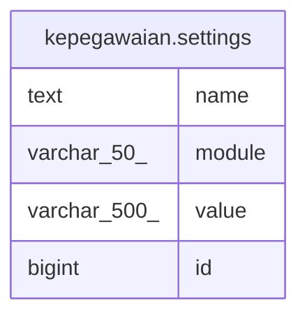

# kepegawaian.settings

## Description

## Columns

| Name | Type | Default | Nullable | Children | Parents | Comment |
| ---- | ---- | ------- | -------- | -------- | ------- | ------- |
| name | text |  | false |  |  |  |
| module | varchar(50) |  | false |  |  |  |
| value | varchar(500) |  | false |  |  |  |
| id | bigint | nextval('kepegawaian.settings_id_seq'::regclass) | false |  |  |  |

## Constraints

| Name | Type | Definition |
| ---- | ---- | ---------- |
| settings_pkey | PRIMARY KEY | PRIMARY KEY (id) |

## Indexes

| Name | Definition |
| ---- | ---------- |
| settings_pkey | CREATE UNIQUE INDEX settings_pkey ON kepegawaian.settings USING btree (id) |
| settings_name_idx | CREATE UNIQUE INDEX settings_name_idx ON kepegawaian.settings USING btree (name) |

## Relations

---

> Generated by [tbls](https://github.com/k1LoW/tbls)
