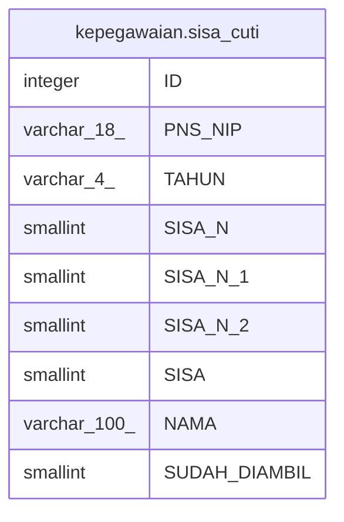

# kepegawaian.sisa_cuti

## Description

## Columns

| Name | Type | Default | Nullable | Children | Parents | Comment |
| ---- | ---- | ------- | -------- | -------- | ------- | ------- |
| ID | integer | nextval('kepegawaian."sisa_cuti_ID_seq"'::regclass) | false |  |  |  |
| PNS_NIP | varchar(18) |  | false |  |  |  |
| TAHUN | varchar(4) |  | false |  |  |  |
| SISA_N | smallint |  | true |  |  |  |
| SISA_N_1 | smallint |  | true |  |  |  |
| SISA_N_2 | smallint |  | true |  |  |  |
| SISA | smallint |  | true |  |  |  |
| NAMA | varchar(100) |  | true |  |  |  |
| SUDAH_DIAMBIL | smallint |  | true |  |  |  |

## Constraints

| Name | Type | Definition |
| ---- | ---- | ---------- |
| pk_sisa_cuti | PRIMARY KEY | PRIMARY KEY ("ID") |

## Indexes

| Name | Definition |
| ---- | ---------- |
| pk_sisa_cuti | CREATE UNIQUE INDEX pk_sisa_cuti ON kepegawaian.sisa_cuti USING btree ("ID") |

## Relations

---

> Generated by [tbls](https://github.com/k1LoW/tbls)
