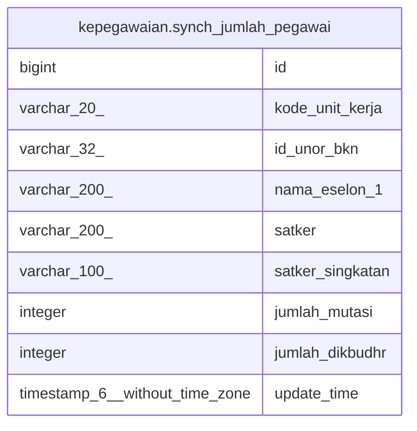

# kepegawaian.synch_jumlah_pegawai

## Description

## Columns

| Name | Type | Default | Nullable | Children | Parents | Comment |
| ---- | ---- | ------- | -------- | -------- | ------- | ------- |
| id | bigint | nextval('kepegawaian.synch_jumlah_pegawai_id_seq'::regclass) | false |  |  |  |
| kode_unit_kerja | varchar(20) |  | true |  |  |  |
| id_unor_bkn | varchar(32) |  | true |  |  |  |
| nama_eselon_1 | varchar(200) |  | true |  |  |  |
| satker | varchar(200) |  | true |  |  |  |
| satker_singkatan | varchar(100) |  | true |  |  |  |
| jumlah_mutasi | integer |  | true |  |  |  |
| jumlah_dikbudhr | integer |  | true |  |  |  |
| update_time | timestamp(6) without time zone |  | true |  |  |  |

## Constraints

| Name | Type | Definition |
| ---- | ---- | ---------- |
| synch_jumlah_pegawai_pkey | PRIMARY KEY | PRIMARY KEY (id) |

## Indexes

| Name | Definition |
| ---- | ---------- |
| synch_jumlah_pegawai_pkey | CREATE UNIQUE INDEX synch_jumlah_pegawai_pkey ON kepegawaian.synch_jumlah_pegawai USING btree (id) |

## Relations

---

> Generated by [tbls](https://github.com/k1LoW/tbls)
