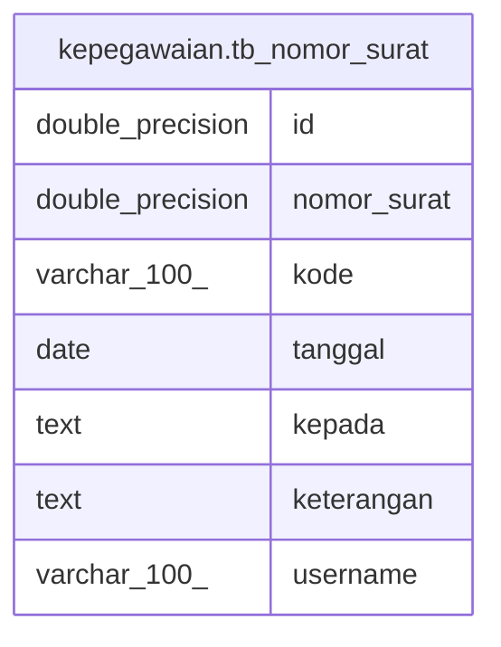

# kepegawaian.tb_nomor_surat

## Description

## Columns

| Name | Type | Default | Nullable | Children | Parents | Comment |
| ---- | ---- | ------- | -------- | -------- | ------- | ------- |
| id | double precision |  | false |  |  |  |
| nomor_surat | double precision |  | false |  |  |  |
| kode | varchar(100) |  | false |  |  |  |
| tanggal | date |  | false |  |  |  |
| kepada | text |  | false |  |  |  |
| keterangan | text |  | false |  |  |  |
| username | varchar(100) |  | false |  |  |  |

## Constraints

| Name | Type | Definition |
| ---- | ---- | ---------- |
| tb_nomor_surat_pkey | PRIMARY KEY | PRIMARY KEY (id) |

## Indexes

| Name | Definition |
| ---- | ---------- |
| tb_nomor_surat_pkey | CREATE UNIQUE INDEX tb_nomor_surat_pkey ON kepegawaian.tb_nomor_surat USING btree (id) |

## Relations

---

> Generated by [tbls](https://github.com/k1LoW/tbls)
