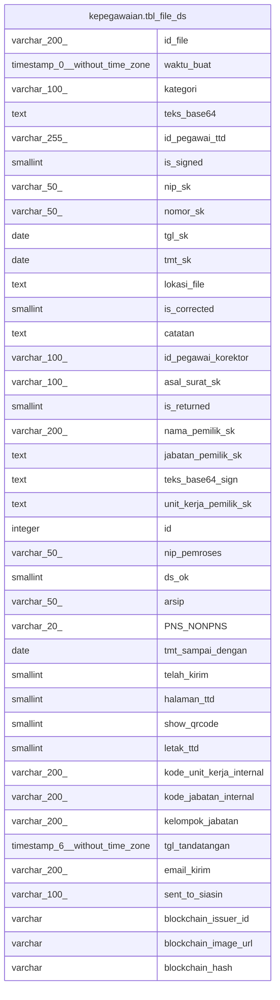

# kepegawaian.tbl_file_ds

## Description

## Columns

| Name | Type | Default | Nullable | Children | Parents | Comment |
| ---- | ---- | ------- | -------- | -------- | ------- | ------- |
| id_file | varchar(200) |  | false |  |  |  |
| waktu_buat | timestamp(0) without time zone |  | true |  |  |  |
| kategori | varchar(100) |  | true |  |  |  |
| teks_base64 | text |  | true |  |  |  |
| id_pegawai_ttd | varchar(255) |  | true |  |  |  |
| is_signed | smallint |  | true |  |  |  |
| nip_sk | varchar(50) |  | true |  |  |  |
| nomor_sk | varchar(50) |  | true |  |  |  |
| tgl_sk | date |  | true |  |  |  |
| tmt_sk | date |  | true |  |  |  |
| lokasi_file | text |  | true |  |  |  |
| is_corrected | smallint |  | true |  |  |  |
| catatan | text |  | true |  |  |  |
| id_pegawai_korektor | varchar(100) |  | true |  |  |  |
| asal_surat_sk | varchar(100) |  | true |  |  |  |
| is_returned | smallint |  | true |  |  |  |
| nama_pemilik_sk | varchar(200) |  | true |  |  |  |
| jabatan_pemilik_sk | text |  | true |  |  |  |
| teks_base64_sign | text |  | true |  |  |  |
| unit_kerja_pemilik_sk | text |  | true |  |  |  |
| id | integer | nextval('kepegawaian.tbl_file_ds_id_seq'::regclass) | false |  |  |  |
| nip_pemroses | varchar(50) |  | true |  |  |  |
| ds_ok | smallint |  | true |  |  |  |
| arsip | varchar(50) |  | true |  |  |  |
| PNS_NONPNS | varchar(20) |  | true |  |  |  |
| tmt_sampai_dengan | date |  | true |  |  | khusus untuk Surat Perintah PLT/PLH |
| telah_kirim | smallint |  | true |  |  | Jika 1, tampilkan di dikbudHR |
| halaman_ttd | smallint | 1 | true |  |  | halaman diletakan tandataangan digital |
| show_qrcode | smallint | 0 | true |  |  | 0/null : tidak tampilkan (seperti semula), 1 : tampilkan qrdari bssn |
| letak_ttd | smallint | 0 | true |  |  | 1:tengah bawah, 2 : kiri Bawah 0: kanan bawah |
| kode_unit_kerja_internal | varchar(200) |  | true |  |  | untuk menampung nama unit kerja internal via kode |
| kode_jabatan_internal | varchar(200) |  | true |  |  | untuk menampung nama jabatan dengan kode jabatan internal |
| kelompok_jabatan | varchar(200) |  | true |  |  | khusus untuk keperluan laporan rekap |
| tgl_tandatangan | timestamp(6) without time zone |  | true |  |  | untuk mengetahui tgl tandatangan |
| email_kirim | varchar(200) |  | true |  |  | Untuk menentukan alamat alternatif pengiriman dokumen |
| sent_to_siasin | varchar(100) | 'n'::character varying | true |  |  |  |
| blockchain_issuer_id | varchar |  | true |  |  |  |
| blockchain_image_url | varchar |  | true |  |  |  |
| blockchain_hash | varchar |  | true |  |  |  |

## Constraints

| Name | Type | Definition |
| ---- | ---- | ---------- |
| tbl_file_ds_pkey | PRIMARY KEY | PRIMARY KEY (id_file) |

## Indexes

| Name | Definition |
| ---- | ---------- |
| tbl_file_ds_pkey | CREATE UNIQUE INDEX tbl_file_ds_pkey ON kepegawaian.tbl_file_ds USING btree (id_file) |

## Relations

---

> Generated by [tbls](https://github.com/k1LoW/tbls)
