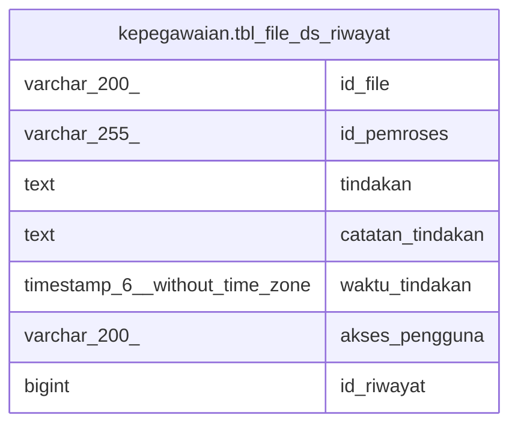

# kepegawaian.tbl_file_ds_riwayat

## Description

## Columns

| Name | Type | Default | Nullable | Children | Parents | Comment |
| ---- | ---- | ------- | -------- | -------- | ------- | ------- |
| id_file | varchar(200) |  | true |  |  |  |
| id_pemroses | varchar(255) |  | true |  |  |  |
| tindakan | text |  | true |  |  |  |
| catatan_tindakan | text |  | true |  |  |  |
| waktu_tindakan | timestamp(6) without time zone |  | true |  |  |  |
| akses_pengguna | varchar(200) |  | true |  |  |  |
| id_riwayat | bigint | nextval('kepegawaian.tbl_file_ds_riwayat_id_riwayat_seq'::regclass) | false |  |  |  |

## Relations

---

> Generated by [tbls](https://github.com/k1LoW/tbls)
