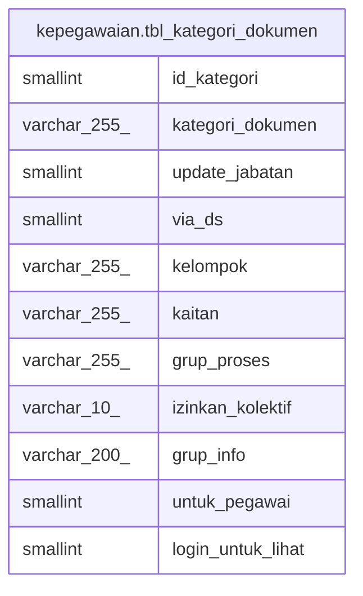

# kepegawaian.tbl_kategori_dokumen

## Description

## Columns

| Name | Type | Default | Nullable | Children | Parents | Comment |
| ---- | ---- | ------- | -------- | -------- | ------- | ------- |
| id_kategori | smallint |  | false |  |  |  |
| kategori_dokumen | varchar(255) |  | true |  |  |  |
| update_jabatan | smallint |  | true |  |  |  |
| via_ds | smallint |  | true |  |  |  |
| kelompok | varchar(255) |  | true |  |  |  |
| kaitan | varchar(255) |  | true |  |  |  |
| grup_proses | varchar(255) |  | true |  |  |  |
| izinkan_kolektif | varchar(10) |  | true |  |  |  |
| grup_info | varchar(200) |  | true |  |  |  |
| untuk_pegawai | smallint |  | true |  |  |  |
| login_untuk_lihat | smallint |  | true |  |  |  |

## Constraints

| Name | Type | Definition |
| ---- | ---- | ---------- |
| tbl_kategori_dokumen_pkey | PRIMARY KEY | PRIMARY KEY (id_kategori) |

## Indexes

| Name | Definition |
| ---- | ---------- |
| tbl_kategori_dokumen_pkey | CREATE UNIQUE INDEX tbl_kategori_dokumen_pkey ON kepegawaian.tbl_kategori_dokumen USING btree (id_kategori) |

## Relations

---

> Generated by [tbls](https://github.com/k1LoW/tbls)
