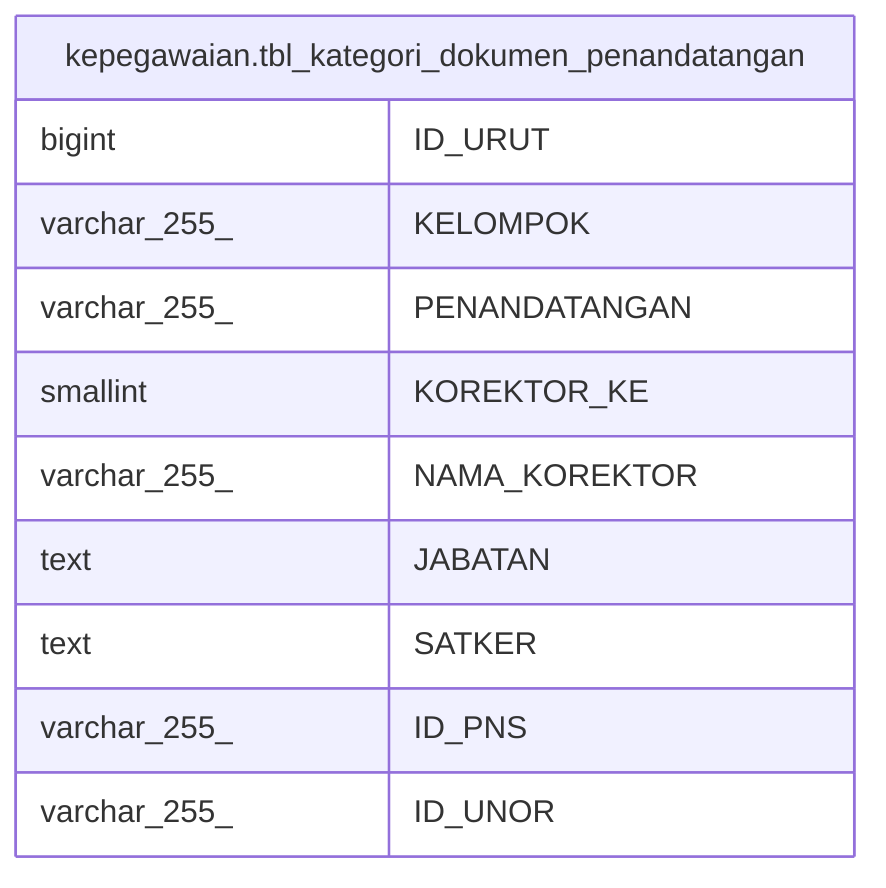

# kepegawaian.tbl_kategori_dokumen_penandatangan

## Description

## Columns

| Name | Type | Default | Nullable | Children | Parents | Comment |
| ---- | ---- | ------- | -------- | -------- | ------- | ------- |
| ID_URUT | bigint |  | false |  |  |  |
| KELOMPOK | varchar(255) |  | true |  |  |  |
| PENANDATANGAN | varchar(255) |  | true |  |  |  |
| KOREKTOR_KE | smallint |  | true |  |  |  |
| NAMA_KOREKTOR | varchar(255) |  | true |  |  |  |
| JABATAN | text |  | true |  |  |  |
| SATKER | text |  | true |  |  |  |
| ID_PNS | varchar(255) |  | true |  |  |  |
| ID_UNOR | varchar(255) |  | true |  |  |  |

## Constraints

| Name | Type | Definition |
| ---- | ---- | ---------- |
| tbl_kategori_dokumen_penandatangan_pkey | PRIMARY KEY | PRIMARY KEY ("ID_URUT") |

## Indexes

| Name | Definition |
| ---- | ---------- |
| tbl_kategori_dokumen_penandatangan_pkey | CREATE UNIQUE INDEX tbl_kategori_dokumen_penandatangan_pkey ON kepegawaian.tbl_kategori_dokumen_penandatangan USING btree ("ID_URUT") |

## Relations

---

> Generated by [tbls](https://github.com/k1LoW/tbls)
