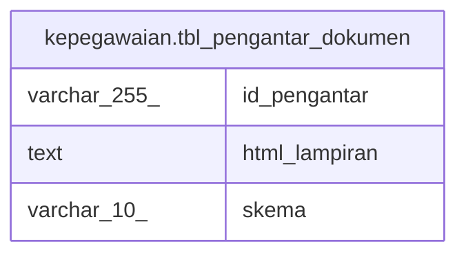

# kepegawaian.tbl_pengantar_dokumen

## Description

## Columns

| Name | Type | Default | Nullable | Children | Parents | Comment |
| ---- | ---- | ------- | -------- | -------- | ------- | ------- |
| id_pengantar | varchar(255) |  | false |  |  |  |
| html_lampiran | text |  | true |  |  |  |
| skema | varchar(10) |  | true |  |  |  |

## Constraints

| Name | Type | Definition |
| ---- | ---- | ---------- |
| tbl_pengantar_dokumen_pkey | PRIMARY KEY | PRIMARY KEY (id_pengantar) |

## Indexes

| Name | Definition |
| ---- | ---------- |
| tbl_pengantar_dokumen_pkey | CREATE UNIQUE INDEX tbl_pengantar_dokumen_pkey ON kepegawaian.tbl_pengantar_dokumen USING btree (id_pengantar) |

## Relations

---

> Generated by [tbls](https://github.com/k1LoW/tbls)
