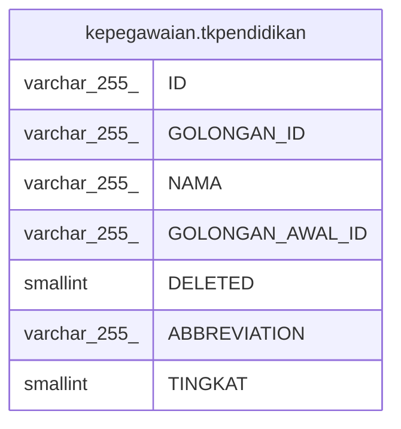

# kepegawaian.tkpendidikan

## Description

## Columns

| Name | Type | Default | Nullable | Children | Parents | Comment |
| ---- | ---- | ------- | -------- | -------- | ------- | ------- |
| ID | varchar(255) |  | false |  |  |  |
| GOLONGAN_ID | varchar(255) |  | true |  |  |  |
| NAMA | varchar(255) |  | true |  |  |  |
| GOLONGAN_AWAL_ID | varchar(255) |  | true |  |  |  |
| DELETED | smallint |  | true |  |  |  |
| ABBREVIATION | varchar(255) |  | true |  |  |  |
| TINGKAT | smallint |  | true |  |  |  |

## Constraints

| Name | Type | Definition |
| ---- | ---- | ---------- |
| tkpendidikan_pkey | PRIMARY KEY | PRIMARY KEY ("ID") |

## Indexes

| Name | Definition |
| ---- | ---------- |
| tkpendidikan_pkey | CREATE UNIQUE INDEX tkpendidikan_pkey ON kepegawaian.tkpendidikan USING btree ("ID") |

## Relations

---

> Generated by [tbls](https://github.com/k1LoW/tbls)
