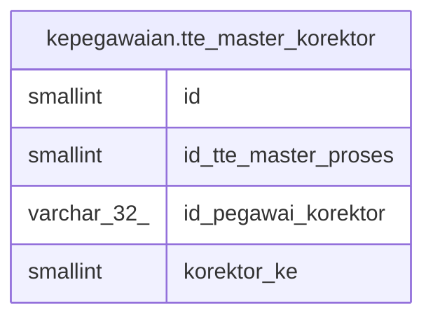

# kepegawaian.tte_master_korektor

## Description

## Columns

| Name | Type | Default | Nullable | Children | Parents | Comment |
| ---- | ---- | ------- | -------- | -------- | ------- | ------- |
| id | smallint | nextval('kepegawaian.tte_master_korektor_id_seq'::regclass) | false |  |  |  |
| id_tte_master_proses | smallint |  | true |  |  |  |
| id_pegawai_korektor | varchar(32) |  | true |  |  |  |
| korektor_ke | smallint |  | true |  |  |  |

## Constraints

| Name | Type | Definition |
| ---- | ---- | ---------- |
| tte_master_korektor_pkey | PRIMARY KEY | PRIMARY KEY (id) |

## Indexes

| Name | Definition |
| ---- | ---------- |
| tte_master_korektor_pkey | CREATE UNIQUE INDEX tte_master_korektor_pkey ON kepegawaian.tte_master_korektor USING btree (id) |

## Relations

---

> Generated by [tbls](https://github.com/k1LoW/tbls)
