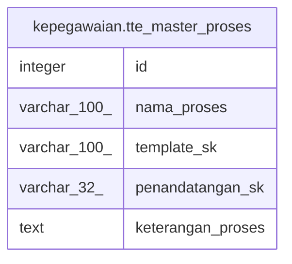

# kepegawaian.tte_master_proses

## Description

## Columns

| Name | Type | Default | Nullable | Children | Parents | Comment |
| ---- | ---- | ------- | -------- | -------- | ------- | ------- |
| id | integer | nextval('kepegawaian.tte_master_proses_id_seq'::regclass) | false |  |  |  |
| nama_proses | varchar(100) |  | false |  |  |  |
| template_sk | varchar(100) |  | true |  |  |  |
| penandatangan_sk | varchar(32) |  | true |  |  |  |
| keterangan_proses | text |  | true |  |  |  |

## Constraints

| Name | Type | Definition |
| ---- | ---- | ---------- |
| pk_tte_master_proses | PRIMARY KEY | PRIMARY KEY (id) |

## Indexes

| Name | Definition |
| ---- | ---------- |
| pk_tte_master_proses | CREATE UNIQUE INDEX pk_tte_master_proses ON kepegawaian.tte_master_proses USING btree (id) |

## Relations

---

> Generated by [tbls](https://github.com/k1LoW/tbls)
