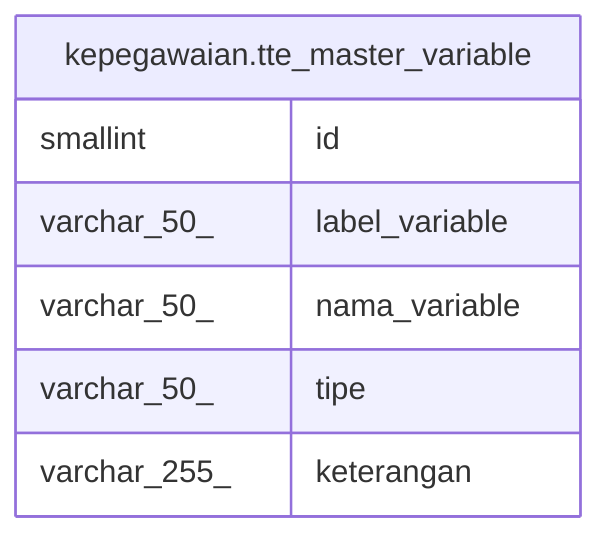

# kepegawaian.tte_master_variable

## Description

## Columns

| Name | Type | Default | Nullable | Children | Parents | Comment |
| ---- | ---- | ------- | -------- | -------- | ------- | ------- |
| id | smallint | nextval('kepegawaian."tte_ master_variable_id_seq"'::regclass) | false |  |  |  |
| label_variable | varchar(50) |  | true |  |  |  |
| nama_variable | varchar(50) |  | true |  |  |  |
| tipe | varchar(50) |  | true |  |  |  |
| keterangan | varchar(255) |  | true |  |  |  |

## Constraints

| Name | Type | Definition |
| ---- | ---- | ---------- |
| tte_ master_variable_pkey | PRIMARY KEY | PRIMARY KEY (id) |

## Indexes

| Name | Definition |
| ---- | ---------- |
| tte_ master_variable_pkey | CREATE UNIQUE INDEX "tte_ master_variable_pkey" ON kepegawaian.tte_master_variable USING btree (id) |

## Relations

---

> Generated by [tbls](https://github.com/k1LoW/tbls)
