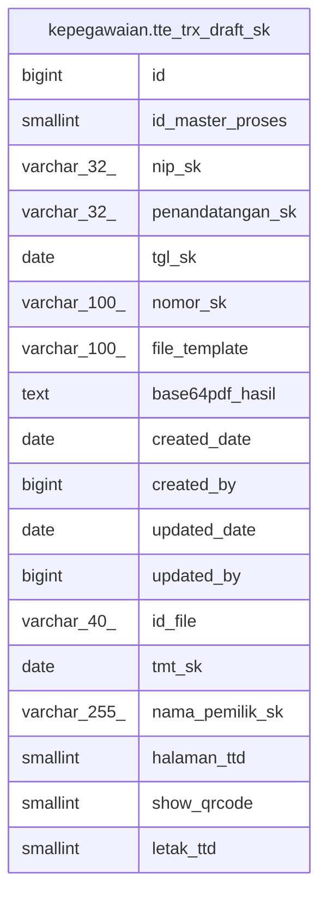

# kepegawaian.tte_trx_draft_sk

## Description

## Columns

| Name | Type | Default | Nullable | Children | Parents | Comment |
| ---- | ---- | ------- | -------- | -------- | ------- | ------- |
| id | bigint | nextval('kepegawaian.tte_trx_draft_sk_id_seq'::regclass) | false |  |  |  |
| id_master_proses | smallint |  | true |  |  |  |
| nip_sk | varchar(32) |  | true |  |  |  |
| penandatangan_sk | varchar(32) |  | true |  |  |  |
| tgl_sk | date |  | true |  |  |  |
| nomor_sk | varchar(100) |  | true |  |  |  |
| file_template | varchar(100) |  | true |  |  |  |
| base64pdf_hasil | text |  | true |  |  |  |
| created_date | date |  | true |  |  |  |
| created_by | bigint |  | true |  |  |  |
| updated_date | date |  | true |  |  |  |
| updated_by | bigint |  | true |  |  |  |
| id_file | varchar(40) |  | true |  |  |  |
| tmt_sk | date |  | true |  |  |  |
| nama_pemilik_sk | varchar(255) |  | true |  |  | nama pemilik sk |
| halaman_ttd | smallint | 1 | true |  |  |  |
| show_qrcode | smallint | 0 | true |  |  |  |
| letak_ttd | smallint | 0 | true |  |  |  |

## Constraints

| Name | Type | Definition |
| ---- | ---- | ---------- |
| tte_trx_draft_sk_pkey | PRIMARY KEY | PRIMARY KEY (id) |

## Indexes

| Name | Definition |
| ---- | ---------- |
| tte_trx_draft_sk_pkey | CREATE UNIQUE INDEX tte_trx_draft_sk_pkey ON kepegawaian.tte_trx_draft_sk USING btree (id) |

## Relations

---

> Generated by [tbls](https://github.com/k1LoW/tbls)
