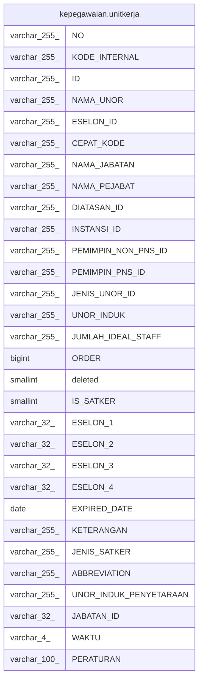

# kepegawaian.unitkerja

## Description

## Columns

| Name | Type | Default | Nullable | Children | Parents | Comment |
| ---- | ---- | ------- | -------- | -------- | ------- | ------- |
| NO | varchar(255) |  | true |  |  |  |
| KODE_INTERNAL | varchar(255) |  | true |  |  |  |
| ID | varchar(255) |  | false |  |  |  |
| NAMA_UNOR | varchar(255) |  | true |  |  |  |
| ESELON_ID | varchar(255) |  | true |  |  |  |
| CEPAT_KODE | varchar(255) |  | true |  |  |  |
| NAMA_JABATAN | varchar(255) |  | true |  |  |  |
| NAMA_PEJABAT | varchar(255) |  | true |  |  |  |
| DIATASAN_ID | varchar(255) |  | true |  |  |  |
| INSTANSI_ID | varchar(255) |  | true |  |  |  |
| PEMIMPIN_NON_PNS_ID | varchar(255) |  | true |  |  |  |
| PEMIMPIN_PNS_ID | varchar(255) |  | true |  |  |  |
| JENIS_UNOR_ID | varchar(255) |  | true |  |  |  |
| UNOR_INDUK | varchar(255) |  | true |  |  |  |
| JUMLAH_IDEAL_STAFF | varchar(255) |  | true |  |  |  |
| ORDER | bigint |  | true |  |  |  |
| deleted | smallint |  | true |  |  |  |
| IS_SATKER | smallint | 0 | false |  |  |  |
| ESELON_1 | varchar(32) |  | true |  |  |  |
| ESELON_2 | varchar(32) |  | true |  |  |  |
| ESELON_3 | varchar(32) |  | true |  |  |  |
| ESELON_4 | varchar(32) |  | true |  |  |  |
| EXPIRED_DATE | date |  | true |  |  |  |
| KETERANGAN | varchar(255) |  | true |  |  |  |
| JENIS_SATKER | varchar(255) |  | true |  |  |  |
| ABBREVIATION | varchar(255) |  | true |  |  |  |
| UNOR_INDUK_PENYETARAAN | varchar(255) |  | true |  |  |  |
| JABATAN_ID | varchar(32) |  | true |  |  |  |
| WAKTU | varchar(4) |  | true |  |  |  |
| PERATURAN | varchar(100) |  | true |  |  |  |

## Constraints

| Name | Type | Definition |
| ---- | ---- | ---------- |
| unitkerja_pkey1 | PRIMARY KEY | PRIMARY KEY ("ID") |

## Indexes

| Name | Definition |
| ---- | ---------- |
| unitkerja_pkey1 | CREATE UNIQUE INDEX unitkerja_pkey1 ON kepegawaian.unitkerja USING btree ("ID") |

## Relations

---

> Generated by [tbls](https://github.com/k1LoW/tbls)
