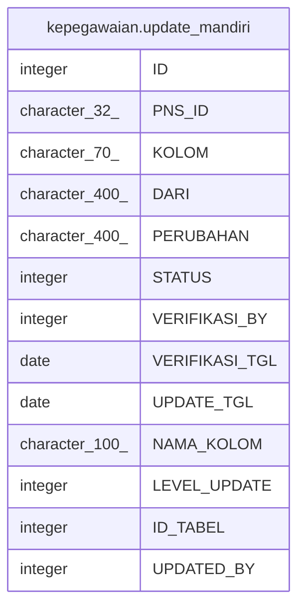

# kepegawaian.update_mandiri

## Description

## Columns

| Name | Type | Default | Nullable | Children | Parents | Comment |
| ---- | ---- | ------- | -------- | -------- | ------- | ------- |
| ID | integer | nextval('kepegawaian."update_mandiri_ID_seq"'::regclass) | false |  |  |  |
| PNS_ID | character(32) |  | true |  |  |  |
| KOLOM | character(70) |  | true |  |  |  |
| DARI | character(400) |  | true |  |  |  |
| PERUBAHAN | character(400) |  | true |  |  |  |
| STATUS | integer |  | true |  |  |  |
| VERIFIKASI_BY | integer |  | true |  |  |  |
| VERIFIKASI_TGL | date |  | true |  |  |  |
| UPDATE_TGL | date |  | true |  |  |  |
| NAMA_KOLOM | character(100) |  | true |  |  |  |
| LEVEL_UPDATE | integer |  | true |  |  |  |
| ID_TABEL | integer |  | true |  |  |  |
| UPDATED_BY | integer |  | true |  |  |  |

## Constraints

| Name | Type | Definition |
| ---- | ---- | ---------- |
| update_mandiri_pkey | PRIMARY KEY | PRIMARY KEY ("ID") |

## Indexes

| Name | Definition |
| ---- | ---------- |
| update_mandiri_pkey | CREATE UNIQUE INDEX update_mandiri_pkey ON kepegawaian.update_mandiri USING btree ("ID") |

## Relations

---

> Generated by [tbls](https://github.com/k1LoW/tbls)
