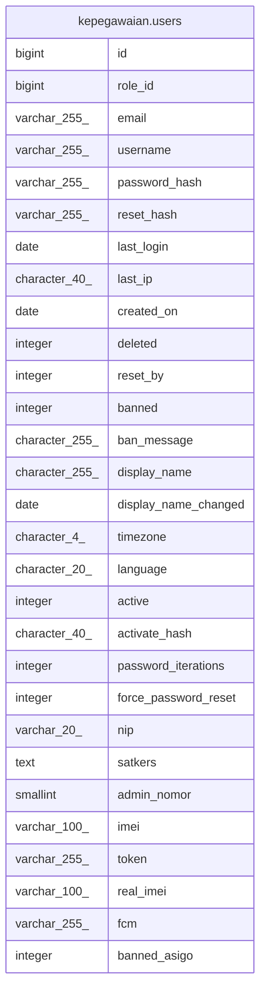

# kepegawaian.users

## Description

## Columns

| Name | Type | Default | Nullable | Children | Parents | Comment |
| ---- | ---- | ------- | -------- | -------- | ------- | ------- |
| id | bigint | nextval('kepegawaian.user_id_seq'::regclass) | false |  |  |  |
| role_id | bigint | (4)::bigint | false |  |  |  |
| email | varchar(255) |  | false |  |  |  |
| username | varchar(255) | ''::bpchar | false |  |  |  |
| password_hash | varchar(255) |  | false |  |  |  |
| reset_hash | varchar(255) | NULL::bpchar | true |  |  |  |
| last_login | date |  | true |  |  |  |
| last_ip | character(40) | ''::bpchar | false |  |  |  |
| created_on | date |  | true |  |  |  |
| deleted | integer | 0 | false |  |  |  |
| reset_by | integer |  | true |  |  |  |
| banned | integer | 0 | false |  |  |  |
| ban_message | character(255) | NULL::bpchar | true |  |  |  |
| display_name | character(255) | ''::bpchar | true |  |  |  |
| display_name_changed | date |  | true |  |  |  |
| timezone | character(4) | 'UM7'::bpchar | false |  |  |  |
| language | character(20) | 'english'::bpchar | false |  |  |  |
| active | integer | 0 | false |  |  |  |
| activate_hash | character(40) | ''::bpchar | false |  |  |  |
| password_iterations | integer |  | false |  |  |  |
| force_password_reset | integer | 0 | false |  |  |  |
| nip | varchar(20) | NULL::bpchar | true |  |  |  |
| satkers | text |  | true |  |  |  |
| admin_nomor | smallint |  | true |  |  |  |
| imei | varchar(100) |  | true |  |  |  |
| token | varchar(255) |  | true |  |  |  |
| real_imei | varchar(100) |  | true |  |  |  |
| fcm | varchar(255) |  | true |  |  |  |
| banned_asigo | integer | 0 | true |  |  |  |

## Constraints

| Name | Type | Definition |
| ---- | ---- | ---------- |
| users_pkey | PRIMARY KEY | PRIMARY KEY (id) |

## Indexes

| Name | Definition |
| ---- | ---------- |
| users_pkey | CREATE UNIQUE INDEX users_pkey ON kepegawaian.users USING btree (id) |
| username_index | CREATE INDEX username_index ON kepegawaian.users USING btree (username) |

## Relations

---

> Generated by [tbls](https://github.com/k1LoW/tbls)
