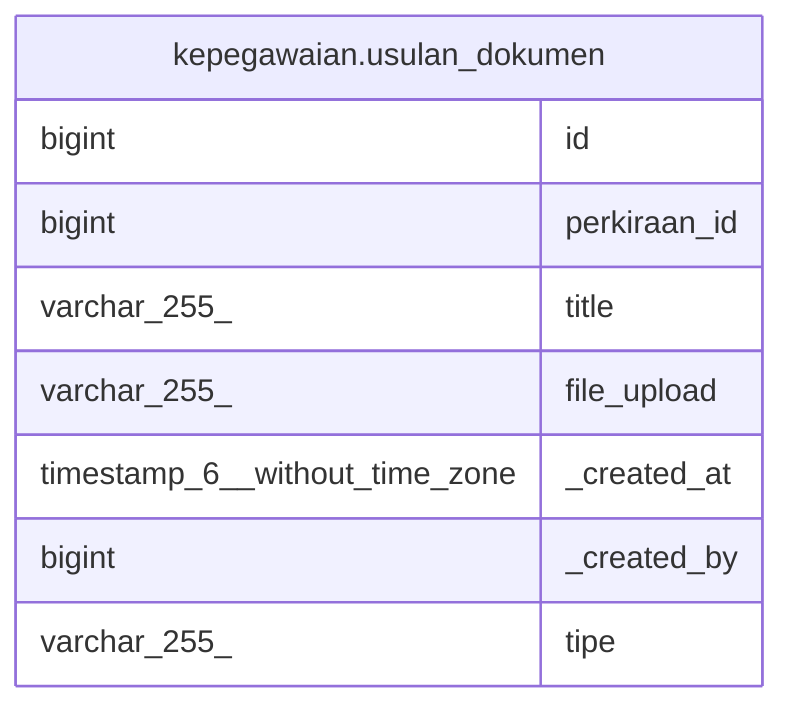

# kepegawaian.usulan_dokumen

## Description

## Columns

| Name | Type | Default | Nullable | Children | Parents | Comment |
| ---- | ---- | ------- | -------- | -------- | ------- | ------- |
| id | bigint | nextval('kepegawaian.usulan_documents_id_seq'::regclass) | false |  |  |  |
| perkiraan_id | bigint |  | true |  |  |  |
| title | varchar(255) |  | true |  |  |  |
| file_upload | varchar(255) |  | true |  |  |  |
| _created_at | timestamp(6) without time zone | now() | true |  |  |  |
| _created_by | bigint |  | true |  |  |  |
| tipe | varchar(255) |  | true |  |  |  |

## Constraints

| Name | Type | Definition |
| ---- | ---- | ---------- |
| perkiraan_kpo_documents_pkey | PRIMARY KEY | PRIMARY KEY (id) |

## Indexes

| Name | Definition |
| ---- | ---------- |
| perkiraan_kpo_documents_pkey | CREATE UNIQUE INDEX perkiraan_kpo_documents_pkey ON kepegawaian.usulan_dokumen USING btree (id) |

## Relations

---

> Generated by [tbls](https://github.com/k1LoW/tbls)
