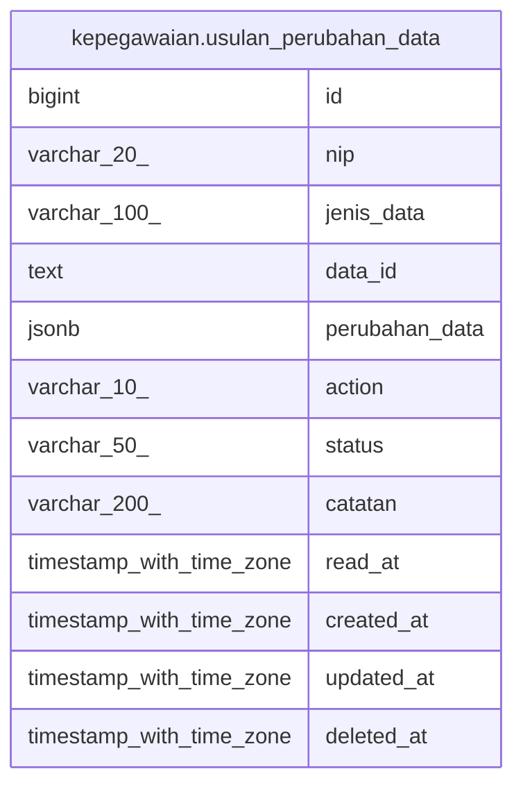

# kepegawaian.usulan_perubahan_data

## Description

## Columns

| Name | Type | Default | Nullable | Children | Parents | Comment |
| ---- | ---- | ------- | -------- | -------- | ------- | ------- |
| id | bigint | nextval('usulan_perubahan_data_id_seq'::regclass) | false |  |  |  |
| nip | varchar(20) |  | false |  |  |  |
| jenis_data | varchar(100) |  | false |  |  |  |
| data_id | text |  | true |  |  |  |
| perubahan_data | jsonb |  | false |  |  |  |
| action | varchar(10) |  | false |  |  |  |
| status | varchar(50) | 'Diusulkan'::character varying | false |  |  |  |
| catatan | varchar(200) |  | true |  |  |  |
| read_at | timestamp with time zone |  | true |  |  |  |
| created_at | timestamp with time zone | now() | false |  |  |  |
| updated_at | timestamp with time zone | now() | false |  |  |  |
| deleted_at | timestamp with time zone |  | true |  |  |  |

## Constraints

| Name | Type | Definition |
| ---- | ---- | ---------- |
| usulan_perubahan_data_pkey | PRIMARY KEY | PRIMARY KEY (id) |

## Indexes

| Name | Definition |
| ---- | ---------- |
| usulan_perubahan_data_pkey | CREATE UNIQUE INDEX usulan_perubahan_data_pkey ON kepegawaian.usulan_perubahan_data USING btree (id) |
| usulan_perubahan_data_nip_idx | CREATE INDEX usulan_perubahan_data_nip_idx ON kepegawaian.usulan_perubahan_data USING btree (nip) |
| usulan_perubahan_data_jenis_data_idx | CREATE INDEX usulan_perubahan_data_jenis_data_idx ON kepegawaian.usulan_perubahan_data USING btree (jenis_data) |
| usulan_perubahan_data_status_idx | CREATE INDEX usulan_perubahan_data_status_idx ON kepegawaian.usulan_perubahan_data USING btree (status) |
| usulan_perubahan_data_jenis_data_data_id_diusulkan_unique_idx | CREATE UNIQUE INDEX usulan_perubahan_data_jenis_data_data_id_diusulkan_unique_idx ON kepegawaian.usulan_perubahan_data USING btree (jenis_data, data_id) WHERE (((status)::text = 'Diusulkan'::text) AND (data_id IS NOT NULL) AND (deleted_at IS NULL)) |

## Relations

---

> Generated by [tbls](https://github.com/k1LoW/tbls)
