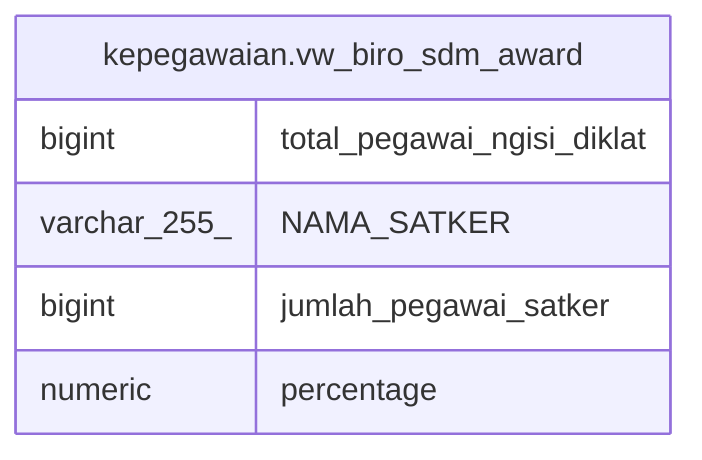

# kepegawaian.vw_biro_sdm_award

## Description

<details>
<summary><strong>Table Definition</strong></summary>

```sql
CREATE VIEW vw_biro_sdm_award AS (
 SELECT count(DISTINCT vw_diklat."NIP_BARU") AS total_pegawai_ngisi_diklat,
    vw_diklat."NAMA_SATKER",
    max(vw_rekap.total_pegawai) AS jumlah_pegawai_satker,
    round((((count(DISTINCT vw_diklat."NIP_BARU"))::numeric / max((vw_rekap.total_pegawai)::numeric)) * (100)::numeric)) AS percentage
   FROM (kepegawaian.vw_rekap_pegawai_per_satker vw_rekap
     LEFT JOIN kepegawaian.vw_rekap_input_diklat vw_diklat ON (((vw_rekap."ID_SATKER")::text = (vw_diklat."ID_SATKER")::text)))
  WHERE (vw_diklat.tahun = 2022)
  GROUP BY vw_diklat."NAMA_SATKER"
  ORDER BY vw_diklat."NAMA_SATKER"
)
```

</details>

## Columns

| Name | Type | Default | Nullable | Children | Parents | Comment |
| ---- | ---- | ------- | -------- | -------- | ------- | ------- |
| total_pegawai_ngisi_diklat | bigint |  | true |  |  |  |
| NAMA_SATKER | varchar(255) |  | true |  |  |  |
| jumlah_pegawai_satker | bigint |  | true |  |  |  |
| percentage | numeric |  | true |  |  |  |

## Referenced Tables

| Name | Columns | Comment | Type |
| ---- | ------- | ------- | ---- |
| [kepegawaian.vw_rekap_pegawai_per_satker](kepegawaian.vw_rekap_pegawai_per_satker.md) | 3 | rekap pegawai aktif per satker | VIEW |
| [kepegawaian.vw_rekap_input_diklat](kepegawaian.vw_rekap_input_diklat.md) | 7 |  | VIEW |

## Relations



---

> Generated by [tbls](https://github.com/k1LoW/tbls)
