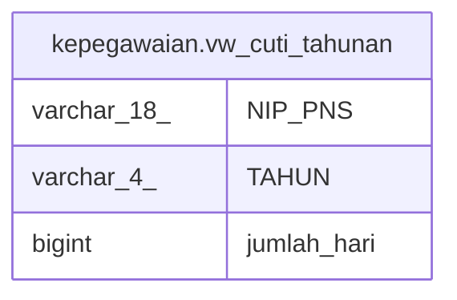

# kepegawaian.vw_cuti_tahunan

## Description

<details>
<summary><strong>Table Definition</strong></summary>

```sql
CREATE VIEW vw_cuti_tahunan AS (
 SELECT i."NIP_PNS",
    i."TAHUN",
    sum(i."JUMLAH") AS jumlah_hari
   FROM (kepegawaian.izin i
     LEFT JOIN kepegawaian.jenis_izin j ON ((i."KODE_IZIN" = j."ID")))
  WHERE ((i."KODE_IZIN" = 1) AND (i."STATUS_PENGAJUAN" = 3))
  GROUP BY i."KODE_IZIN", i."NIP_PNS", i."TAHUN"
)
```

</details>

## Columns

| Name | Type | Default | Nullable | Children | Parents | Comment |
| ---- | ---- | ------- | -------- | -------- | ------- | ------- |
| NIP_PNS | varchar(18) |  | true |  |  |  |
| TAHUN | varchar(4) |  | true |  |  |  |
| jumlah_hari | bigint |  | true |  |  |  |

## Referenced Tables

| Name | Columns | Comment | Type |
| ---- | ------- | ------- | ---- |
| [kepegawaian.izin](kepegawaian.izin.md) | 52 |  | BASE TABLE |
| [kepegawaian.jenis_izin](kepegawaian.jenis_izin.md) | 8 |  | BASE TABLE |

## Relations



---

> Generated by [tbls](https://github.com/k1LoW/tbls)
