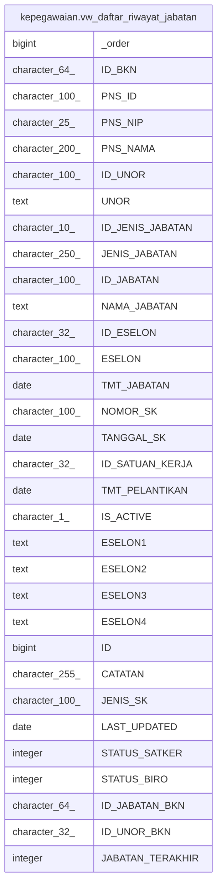

# kepegawaian.vw_daftar_riwayat_jabatan

## Description

<details>
<summary><strong>Table Definition</strong></summary>

```sql
CREATE VIEW vw_daftar_riwayat_jabatan AS (
 SELECT row_number() OVER (PARTITION BY "PNS_ID" ORDER BY "TMT_JABATAN" DESC) AS _order,
    "ID_BKN",
    "PNS_ID",
    "PNS_NIP",
    "PNS_NAMA",
    "ID_UNOR",
    "UNOR",
    "ID_JENIS_JABATAN",
    "JENIS_JABATAN",
    "ID_JABATAN",
    "NAMA_JABATAN",
    "ID_ESELON",
    "ESELON",
    "TMT_JABATAN",
    "NOMOR_SK",
    "TANGGAL_SK",
    "ID_SATUAN_KERJA",
    "TMT_PELANTIKAN",
    "IS_ACTIVE",
    "ESELON1",
    "ESELON2",
    "ESELON3",
    "ESELON4",
    "ID",
    "CATATAN",
    "JENIS_SK",
    "LAST_UPDATED",
    "STATUS_SATKER",
    "STATUS_BIRO",
    "ID_JABATAN_BKN",
    "ID_UNOR_BKN",
    "JABATAN_TERAKHIR"
   FROM kepegawaian.rwt_jabatan_empty rjab
  WHERE ("TMT_JABATAN" IS NOT NULL)
)
```

</details>

## Columns

| Name | Type | Default | Nullable | Children | Parents | Comment |
| ---- | ---- | ------- | -------- | -------- | ------- | ------- |
| _order | bigint |  | true |  |  |  |
| ID_BKN | character(64) |  | true |  |  |  |
| PNS_ID | character(100) |  | true |  |  |  |
| PNS_NIP | character(25) |  | true |  |  |  |
| PNS_NAMA | character(200) |  | true |  |  |  |
| ID_UNOR | character(100) |  | true |  |  |  |
| UNOR | text |  | true |  |  |  |
| ID_JENIS_JABATAN | character(10) |  | true |  |  |  |
| JENIS_JABATAN | character(250) |  | true |  |  |  |
| ID_JABATAN | character(100) |  | true |  |  |  |
| NAMA_JABATAN | text |  | true |  |  |  |
| ID_ESELON | character(32) |  | true |  |  |  |
| ESELON | character(100) |  | true |  |  |  |
| TMT_JABATAN | date |  | true |  |  |  |
| NOMOR_SK | character(100) |  | true |  |  |  |
| TANGGAL_SK | date |  | true |  |  |  |
| ID_SATUAN_KERJA | character(32) |  | true |  |  |  |
| TMT_PELANTIKAN | date |  | true |  |  |  |
| IS_ACTIVE | character(1) |  | true |  |  |  |
| ESELON1 | text |  | true |  |  |  |
| ESELON2 | text |  | true |  |  |  |
| ESELON3 | text |  | true |  |  |  |
| ESELON4 | text |  | true |  |  |  |
| ID | bigint |  | true |  |  |  |
| CATATAN | character(255) |  | true |  |  |  |
| JENIS_SK | character(100) |  | true |  |  |  |
| LAST_UPDATED | date |  | true |  |  |  |
| STATUS_SATKER | integer |  | true |  |  |  |
| STATUS_BIRO | integer |  | true |  |  |  |
| ID_JABATAN_BKN | character(64) |  | true |  |  |  |
| ID_UNOR_BKN | character(32) |  | true |  |  |  |
| JABATAN_TERAKHIR | integer |  | true |  |  |  |

## Referenced Tables

| Name | Columns | Comment | Type |
| ---- | ------- | ------- | ---- |
| [kepegawaian.rwt_jabatan_empty](kepegawaian.rwt_jabatan_empty.md) | 35 |  | BASE TABLE |

## Relations



---

> Generated by [tbls](https://github.com/k1LoW/tbls)
