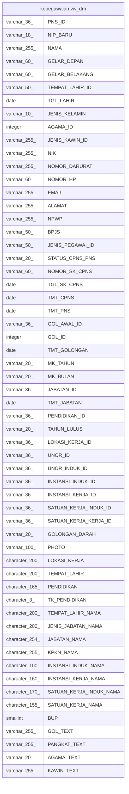

# kepegawaian.vw_drh

## Description

<details>
<summary><strong>Table Definition</strong></summary>

```sql
CREATE VIEW vw_drh AS (
 SELECT pegawai."PNS_ID",
    pegawai."NIP_BARU",
    pegawai."NAMA",
    pegawai."GELAR_DEPAN",
    pegawai."GELAR_BELAKANG",
    pegawai."TEMPAT_LAHIR_ID",
    pegawai."TGL_LAHIR",
    pegawai."JENIS_KELAMIN",
    pegawai."AGAMA_ID",
    pegawai."JENIS_KAWIN_ID",
    pegawai."NIK",
    pegawai."NOMOR_DARURAT",
    pegawai."NOMOR_HP",
    pegawai."EMAIL",
    pegawai."ALAMAT",
    pegawai."NPWP",
    pegawai."BPJS",
    pegawai."JENIS_PEGAWAI_ID",
    pegawai."STATUS_CPNS_PNS",
    pegawai."NOMOR_SK_CPNS",
    pegawai."TGL_SK_CPNS",
    pegawai."TMT_CPNS",
    pegawai."TMT_PNS",
    pegawai."GOL_AWAL_ID",
    pegawai."GOL_ID",
    pegawai."TMT_GOLONGAN",
    pegawai."MK_TAHUN",
    pegawai."MK_BULAN",
    pegawai."JABATAN_ID",
    pegawai."TMT_JABATAN",
    pegawai."PENDIDIKAN_ID",
    pegawai."TAHUN_LULUS",
    pegawai."LOKASI_KERJA_ID",
    pegawai."UNOR_ID",
    pegawai."UNOR_INDUK_ID",
    pegawai."INSTANSI_INDUK_ID",
    pegawai."INSTANSI_KERJA_ID",
    pegawai."SATUAN_KERJA_INDUK_ID",
    pegawai."SATUAN_KERJA_KERJA_ID",
    pegawai."GOLONGAN_DARAH",
    pegawai."PHOTO",
    pegawai."LOKASI_KERJA",
    pegawai."TEMPAT_LAHIR",
    pegawai."PENDIDIKAN",
    pegawai."TK_PENDIDIKAN",
    pegawai."TEMPAT_LAHIR_NAMA",
    pegawai."JENIS_JABATAN_NAMA",
    pegawai."JABATAN_NAMA",
    pegawai."KPKN_NAMA",
    pegawai."INSTANSI_INDUK_NAMA",
    pegawai."INSTANSI_KERJA_NAMA",
    pegawai."SATUAN_KERJA_INDUK_NAMA",
    pegawai."SATUAN_KERJA_NAMA",
    pegawai."BUP",
    golongan."NAMA" AS "GOL_TEXT",
    golongan."NAMA_PANGKAT" AS "PANGKAT_TEXT",
    agama."NAMA" AS "AGAMA_TEXT",
    jenis_kawin."NAMA" AS "KAWIN_TEXT"
   FROM (((kepegawaian.pegawai pegawai
     LEFT JOIN kepegawaian.golongan ON ((golongan."ID" = pegawai."GOL_ID")))
     LEFT JOIN kepegawaian.agama ON ((agama."ID" = pegawai."AGAMA_ID")))
     LEFT JOIN kepegawaian.jenis_kawin ON (((jenis_kawin."ID")::text = (pegawai."JENIS_KAWIN_ID")::text)))
)
```

</details>

## Columns

| Name | Type | Default | Nullable | Children | Parents | Comment |
| ---- | ---- | ------- | -------- | -------- | ------- | ------- |
| PNS_ID | varchar(36) |  | true |  |  |  |
| NIP_BARU | varchar(18) |  | true |  |  |  |
| NAMA | varchar(255) |  | true |  |  |  |
| GELAR_DEPAN | varchar(60) |  | true |  |  |  |
| GELAR_BELAKANG | varchar(60) |  | true |  |  |  |
| TEMPAT_LAHIR_ID | varchar(50) |  | true |  |  |  |
| TGL_LAHIR | date |  | true |  |  |  |
| JENIS_KELAMIN | varchar(10) |  | true |  |  |  |
| AGAMA_ID | integer |  | true |  |  |  |
| JENIS_KAWIN_ID | varchar(255) |  | true |  |  |  |
| NIK | varchar(255) |  | true |  |  |  |
| NOMOR_DARURAT | varchar(255) |  | true |  |  |  |
| NOMOR_HP | varchar(60) |  | true |  |  |  |
| EMAIL | varchar(255) |  | true |  |  |  |
| ALAMAT | varchar(255) |  | true |  |  |  |
| NPWP | varchar(255) |  | true |  |  |  |
| BPJS | varchar(50) |  | true |  |  |  |
| JENIS_PEGAWAI_ID | varchar(50) |  | true |  |  |  |
| STATUS_CPNS_PNS | varchar(20) |  | true |  |  |  |
| NOMOR_SK_CPNS | varchar(60) |  | true |  |  |  |
| TGL_SK_CPNS | date |  | true |  |  |  |
| TMT_CPNS | date |  | true |  |  |  |
| TMT_PNS | date |  | true |  |  |  |
| GOL_AWAL_ID | varchar(36) |  | true |  |  |  |
| GOL_ID | integer |  | true |  |  |  |
| TMT_GOLONGAN | date |  | true |  |  |  |
| MK_TAHUN | varchar(20) |  | true |  |  |  |
| MK_BULAN | varchar(20) |  | true |  |  |  |
| JABATAN_ID | varchar(36) |  | true |  |  |  |
| TMT_JABATAN | date |  | true |  |  |  |
| PENDIDIKAN_ID | varchar(36) |  | true |  |  |  |
| TAHUN_LULUS | varchar(20) |  | true |  |  |  |
| LOKASI_KERJA_ID | varchar(36) |  | true |  |  |  |
| UNOR_ID | varchar(36) |  | true |  |  |  |
| UNOR_INDUK_ID | varchar(36) |  | true |  |  |  |
| INSTANSI_INDUK_ID | varchar(36) |  | true |  |  |  |
| INSTANSI_KERJA_ID | varchar(36) |  | true |  |  |  |
| SATUAN_KERJA_INDUK_ID | varchar(36) |  | true |  |  |  |
| SATUAN_KERJA_KERJA_ID | varchar(36) |  | true |  |  |  |
| GOLONGAN_DARAH | varchar(20) |  | true |  |  |  |
| PHOTO | varchar(100) |  | true |  |  |  |
| LOKASI_KERJA | character(200) |  | true |  |  |  |
| TEMPAT_LAHIR | character(200) |  | true |  |  |  |
| PENDIDIKAN | character(165) |  | true |  |  |  |
| TK_PENDIDIKAN | character(3) |  | true |  |  |  |
| TEMPAT_LAHIR_NAMA | character(200) |  | true |  |  |  |
| JENIS_JABATAN_NAMA | character(200) |  | true |  |  |  |
| JABATAN_NAMA | character(254) |  | true |  |  |  |
| KPKN_NAMA | character(255) |  | true |  |  |  |
| INSTANSI_INDUK_NAMA | character(100) |  | true |  |  |  |
| INSTANSI_KERJA_NAMA | character(160) |  | true |  |  |  |
| SATUAN_KERJA_INDUK_NAMA | character(170) |  | true |  |  |  |
| SATUAN_KERJA_NAMA | character(155) |  | true |  |  |  |
| BUP | smallint |  | true |  |  |  |
| GOL_TEXT | varchar(255) |  | true |  |  |  |
| PANGKAT_TEXT | varchar(255) |  | true |  |  |  |
| AGAMA_TEXT | varchar(20) |  | true |  |  |  |
| KAWIN_TEXT | varchar(255) |  | true |  |  |  |

## Referenced Tables

| Name | Columns | Comment | Type |
| ---- | ------- | ------- | ---- |
| [kepegawaian.pegawai](kepegawaian.pegawai.md) | 100 |  | BASE TABLE |
| [kepegawaian.golongan](kepegawaian.golongan.md) | 6 |  | BASE TABLE |
| [kepegawaian.agama](kepegawaian.agama.md) | 4 |  | BASE TABLE |
| [kepegawaian.jenis_kawin](kepegawaian.jenis_kawin.md) | 2 |  | BASE TABLE |

## Relations



---

> Generated by [tbls](https://github.com/k1LoW/tbls)
