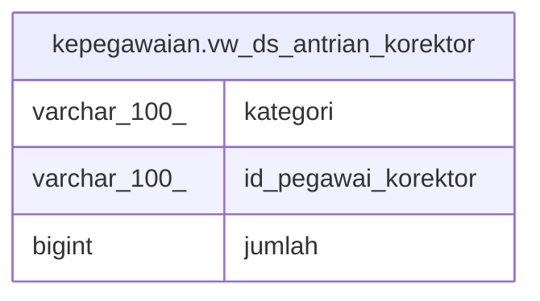

# kepegawaian.vw_ds_antrian_korektor

## Description

<details>
<summary><strong>Table Definition</strong></summary>

```sql
CREATE VIEW vw_ds_antrian_korektor AS (
 SELECT d.kategori,
    k.id_pegawai_korektor,
    count(*) AS jumlah
   FROM (kepegawaian.tbl_file_ds d
     JOIN kepegawaian.vw_ds_korektor k ON (((d.id_file)::text = (k.id_file)::text)))
  WHERE ((d.is_signed <> (1)::smallint) AND (d.ds_ok = 1) AND ((d.kategori)::text <> '< Semua >'::text))
  GROUP BY d.kategori, k.id_pegawai_korektor
)
```

</details>

## Columns

| Name | Type | Default | Nullable | Children | Parents | Comment |
| ---- | ---- | ------- | -------- | -------- | ------- | ------- |
| kategori | varchar(100) |  | true |  |  |  |
| id_pegawai_korektor | varchar(100) |  | true |  |  |  |
| jumlah | bigint |  | true |  |  |  |

## Referenced Tables

| Name | Columns | Comment | Type |
| ---- | ------- | ------- | ---- |
| [kepegawaian.tbl_file_ds](kepegawaian.tbl_file_ds.md) | 39 |  | BASE TABLE |
| [kepegawaian.vw_ds_korektor](kepegawaian.vw_ds_korektor.md) | 4 |  | VIEW |

## Relations



---

> Generated by [tbls](https://github.com/k1LoW/tbls)
