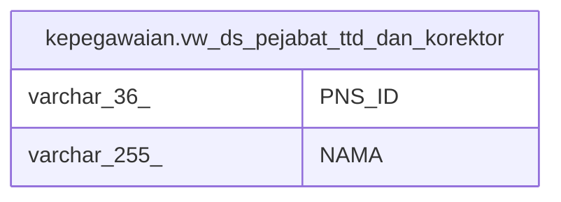

# kepegawaian.vw_ds_pejabat_ttd_dan_korektor

## Description

<details>
<summary><strong>Table Definition</strong></summary>

```sql
CREATE VIEW vw_ds_pejabat_ttd_dan_korektor AS (
 SELECT "PNS_ID",
    "NAMA"
   FROM kepegawaian.pegawai d
  WHERE ((("PNS_ID")::text IN ( SELECT tbl_file_ds.id_pegawai_ttd
           FROM kepegawaian.tbl_file_ds
          WHERE ((tbl_file_ds.ds_ok = '1'::smallint) AND (tbl_file_ds.is_signed <> '1'::smallint) AND (tbl_file_ds.is_signed <> '3'::smallint)))) OR (("PNS_ID")::text IN ( SELECT tbl_file_ds_corrector.id_pegawai_korektor
           FROM kepegawaian.tbl_file_ds_corrector
          WHERE ((tbl_file_ds_corrector.is_corrected = '2'::smallint) AND ((tbl_file_ds_corrector.id_file)::text IN ( SELECT tbl_file_ds.id_file
                   FROM kepegawaian.tbl_file_ds
                  WHERE ((tbl_file_ds.ds_ok = '1'::smallint) AND (tbl_file_ds.is_signed <> '1'::smallint) AND (tbl_file_ds.is_signed <> '3'::smallint))))))))
)
```

</details>

## Columns

| Name | Type | Default | Nullable | Children | Parents | Comment |
| ---- | ---- | ------- | -------- | -------- | ------- | ------- |
| PNS_ID | varchar(36) |  | true |  |  |  |
| NAMA | varchar(255) |  | true |  |  |  |

## Referenced Tables

| Name | Columns | Comment | Type |
| ---- | ------- | ------- | ---- |
| [kepegawaian.pegawai](kepegawaian.pegawai.md) | 100 |  | BASE TABLE |
| [kepegawaian.tbl_file_ds](kepegawaian.tbl_file_ds.md) | 39 |  | BASE TABLE |
| [kepegawaian.tbl_file_ds_corrector](kepegawaian.tbl_file_ds_corrector.md) | 7 |  | BASE TABLE |

## Relations



---

> Generated by [tbls](https://github.com/k1LoW/tbls)
