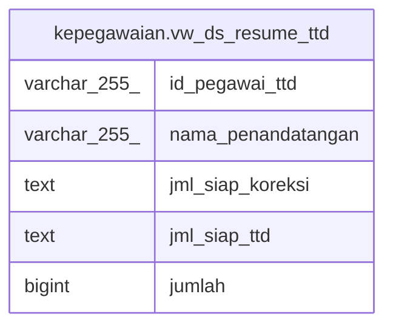

# kepegawaian.vw_ds_resume_ttd

## Description

<details>
<summary><strong>Table Definition</strong></summary>

```sql
CREATE VIEW vw_ds_resume_ttd AS (
 SELECT d.id_pegawai_ttd,
    p."NAMA" AS nama_penandatangan,
    COALESCE(( SELECT (sk.jumlah)::text AS jumlah
           FROM kepegawaian.vw_ds_siap_koreksi sk
          WHERE ((sk.id_pegawai_korektor)::text = (d.id_pegawai_ttd)::text)), '-'::text) AS jml_siap_koreksi,
    COALESCE(( SELECT (s.jumlah)::text AS jumlah
           FROM kepegawaian.vw_ds_siap_ttd s
          WHERE ((s.id_pegawai_ttd)::text = (d.id_pegawai_ttd)::text)), '-'::text) AS jml_siap_ttd,
    (COALESCE(( SELECT sk.jumlah
           FROM kepegawaian.vw_ds_siap_koreksi sk
          WHERE ((sk.id_pegawai_korektor)::text = (d.id_pegawai_ttd)::text)), (0)::bigint) + COALESCE(( SELECT s.jumlah
           FROM kepegawaian.vw_ds_siap_ttd s
          WHERE ((s.id_pegawai_ttd)::text = (d.id_pegawai_ttd)::text)), (0)::bigint)) AS jumlah
   FROM (kepegawaian.tbl_file_ds d
     JOIN kepegawaian.pegawai p ON (((p."PNS_ID")::text = (d.id_pegawai_ttd)::text)))
  WHERE ((d.is_signed <> (1)::smallint) AND (d.ds_ok = 1) AND ((d.kategori)::text <> '< Semua >'::text))
  GROUP BY d.id_pegawai_ttd, p."NAMA"
)
```

</details>

## Columns

| Name | Type | Default | Nullable | Children | Parents | Comment |
| ---- | ---- | ------- | -------- | -------- | ------- | ------- |
| id_pegawai_ttd | varchar(255) |  | true |  |  |  |
| nama_penandatangan | varchar(255) |  | true |  |  |  |
| jml_siap_koreksi | text |  | true |  |  |  |
| jml_siap_ttd | text |  | true |  |  |  |
| jumlah | bigint |  | true |  |  |  |

## Referenced Tables

| Name | Columns | Comment | Type |
| ---- | ------- | ------- | ---- |
| [kepegawaian.vw_ds_siap_koreksi](kepegawaian.vw_ds_siap_koreksi.md) | 3 |  | VIEW |
| [kepegawaian.vw_ds_siap_ttd](kepegawaian.vw_ds_siap_ttd.md) | 3 |  | VIEW |
| [kepegawaian.tbl_file_ds](kepegawaian.tbl_file_ds.md) | 39 |  | BASE TABLE |
| [kepegawaian.pegawai](kepegawaian.pegawai.md) | 100 |  | BASE TABLE |

## Relations



---

> Generated by [tbls](https://github.com/k1LoW/tbls)
