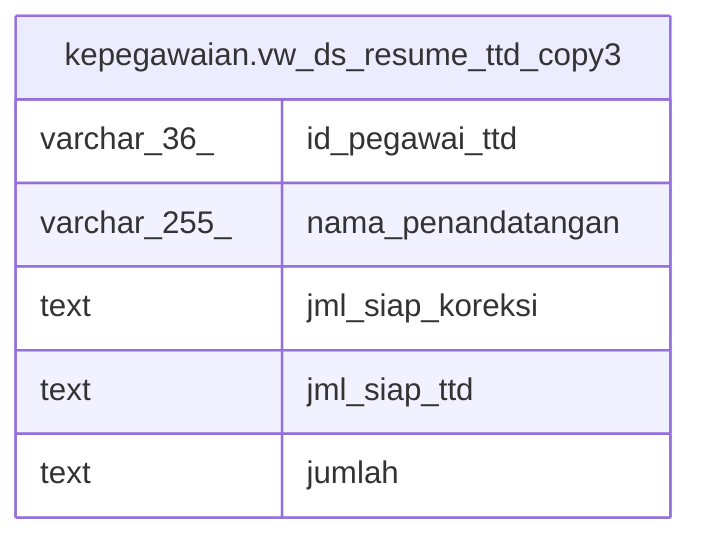

# kepegawaian.vw_ds_resume_ttd_copy3

## Description

<details>
<summary><strong>Table Definition</strong></summary>

```sql
CREATE VIEW vw_ds_resume_ttd_copy3 AS (
 SELECT "PNS_ID" AS id_pegawai_ttd,
    "NAMA" AS nama_penandatangan,
    COALESCE(( SELECT (sk.jumlah)::text AS jumlah
           FROM kepegawaian.vw_ds_siap_koreksi sk
          WHERE ((sk.id_pegawai_korektor)::text = (d."PNS_ID")::text)), '-'::text) AS jml_siap_koreksi,
    COALESCE(( SELECT (s.jumlah)::text AS jumlah
           FROM kepegawaian.vw_ds_siap_ttd s
          WHERE ((s.id_pegawai_ttd)::text = (d."PNS_ID")::text)), '-'::text) AS jml_siap_ttd,
    '-'::text AS jumlah
   FROM kepegawaian.vw_ds_pejabat_ttd_dan_korektor d
)
```

</details>

## Columns

| Name | Type | Default | Nullable | Children | Parents | Comment |
| ---- | ---- | ------- | -------- | -------- | ------- | ------- |
| id_pegawai_ttd | varchar(36) |  | true |  |  |  |
| nama_penandatangan | varchar(255) |  | true |  |  |  |
| jml_siap_koreksi | text |  | true |  |  |  |
| jml_siap_ttd | text |  | true |  |  |  |
| jumlah | text |  | true |  |  |  |

## Referenced Tables

| Name | Columns | Comment | Type |
| ---- | ------- | ------- | ---- |
| [kepegawaian.vw_ds_siap_koreksi](kepegawaian.vw_ds_siap_koreksi.md) | 3 |  | VIEW |
| [kepegawaian.vw_ds_siap_ttd](kepegawaian.vw_ds_siap_ttd.md) | 3 |  | VIEW |
| [kepegawaian.vw_ds_pejabat_ttd_dan_korektor](kepegawaian.vw_ds_pejabat_ttd_dan_korektor.md) | 2 |  | VIEW |

## Relations



---

> Generated by [tbls](https://github.com/k1LoW/tbls)
