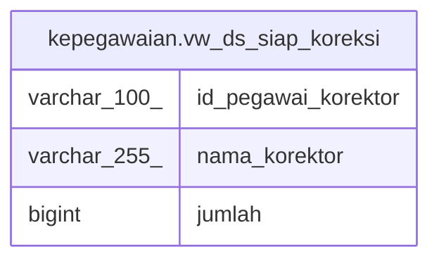

# kepegawaian.vw_ds_siap_koreksi

## Description

<details>
<summary><strong>Table Definition</strong></summary>

```sql
CREATE VIEW vw_ds_siap_koreksi AS (
 SELECT k.id_pegawai_korektor,
    p."NAMA" AS nama_korektor,
    count(*) AS jumlah
   FROM ((kepegawaian.tbl_file_ds d
     JOIN kepegawaian.tbl_file_ds_corrector k ON (((d.id_file)::text = (k.id_file)::text)))
     JOIN kepegawaian.pegawai p ON (((p."PNS_ID")::text = (k.id_pegawai_korektor)::text)))
  WHERE ((d.is_signed = (0)::smallint) AND (d.ds_ok = 1) AND ((d.kategori)::text <> '< Semua >'::text) AND (k.is_corrected = 2))
  GROUP BY k.id_pegawai_korektor, p."NAMA"
)
```

</details>

## Columns

| Name | Type | Default | Nullable | Children | Parents | Comment |
| ---- | ---- | ------- | -------- | -------- | ------- | ------- |
| id_pegawai_korektor | varchar(100) |  | true |  |  |  |
| nama_korektor | varchar(255) |  | true |  |  |  |
| jumlah | bigint |  | true |  |  |  |

## Referenced Tables

| Name | Columns | Comment | Type |
| ---- | ------- | ------- | ---- |
| [kepegawaian.tbl_file_ds](kepegawaian.tbl_file_ds.md) | 39 |  | BASE TABLE |
| [kepegawaian.tbl_file_ds_corrector](kepegawaian.tbl_file_ds_corrector.md) | 7 |  | BASE TABLE |
| [kepegawaian.pegawai](kepegawaian.pegawai.md) | 100 |  | BASE TABLE |

## Relations



---

> Generated by [tbls](https://github.com/k1LoW/tbls)
