# kepegawaian.vw_kgb

## Description

<details>
<summary><strong>Table Definition</strong></summary>

```sql
CREATE VIEW vw_kgb AS (
 SELECT kepegawaian.get_masa_kerja_arr("TMT_CPNS", get_kgb_yad) AS get_masa_kerja_arr,
    get_kgb_yad,
    "ID",
    "PNS_ID",
    "NIP_LAMA",
    "NIP_BARU",
    "NAMA",
    "GELAR_DEPAN",
    "GELAR_BELAKANG",
    "TEMPAT_LAHIR_ID",
    "TGL_LAHIR",
    "JENIS_KELAMIN",
    "AGAMA_ID",
    "JENIS_KAWIN_ID",
    "NIK",
    "NOMOR_DARURAT",
    "NOMOR_HP",
    "EMAIL",
    "ALAMAT",
    "NPWP",
    "BPJS",
    "JENIS_PEGAWAI_ID",
    "KEDUDUKAN_HUKUM_ID",
    "STATUS_CPNS_PNS",
    "KARTU_PEGAWAI",
    "NOMOR_SK_CPNS",
    "TGL_SK_CPNS",
    "TMT_CPNS",
    "TMT_PNS",
    "GOL_AWAL_ID",
    "GOL_ID",
    "TMT_GOLONGAN",
    "MK_TAHUN",
    "MK_BULAN",
    "JENIS_JABATAN_IDx",
    "JABATAN_ID",
    "TMT_JABATAN",
    "PENDIDIKAN_ID",
    "TAHUN_LULUS",
    "KPKN_ID",
    "LOKASI_KERJA_ID",
    "UNOR_ID",
    "UNOR_INDUK_ID",
    "INSTANSI_INDUK_ID",
    "INSTANSI_KERJA_ID",
    "SATUAN_KERJA_INDUK_ID",
    "SATUAN_KERJA_KERJA_ID",
    "GOLONGAN_DARAH",
    "PHOTO",
    "TMT_PENSIUN",
    "LOKASI_KERJA",
    "JML_ISTRI",
    "JML_ANAK",
    "NO_SURAT_DOKTER",
    "TGL_SURAT_DOKTER",
    "NO_BEBAS_NARKOBA",
    "TGL_BEBAS_NARKOBA",
    "NO_CATATAN_POLISI",
    "TGL_CATATAN_POLISI",
    "AKTE_KELAHIRAN",
    "STATUS_HIDUP",
    "AKTE_MENINGGAL",
    "TGL_MENINGGAL",
    "NO_ASKES",
    "NO_TASPEN",
    "TGL_NPWP",
    "TEMPAT_LAHIR",
    "PENDIDIKAN",
    "TK_PENDIDIKAN",
    "TEMPAT_LAHIR_NAMA",
    "JENIS_JABATAN_NAMA",
    "JABATAN_NAMA",
    "KPKN_NAMA",
    "INSTANSI_INDUK_NAMA",
    "INSTANSI_KERJA_NAMA",
    "SATUAN_KERJA_INDUK_NAMA",
    "SATUAN_KERJA_NAMA",
    "JABATAN_INSTANSI_ID",
    "BUP",
    "JABATAN_INSTANSI_NAMA",
    "JENIS_JABATAN_ID",
    terminated_date,
    status_pegawai
   FROM ( SELECT kepegawaian.get_kgb_yad(p."TMT_CPNS") AS get_kgb_yad,
            p."ID",
            p."ID" AS pegawai_id,
            p."PNS_ID",
            p."NIP_LAMA",
            p."NIP_BARU",
            p."NAMA",
            p."GELAR_DEPAN",
            p."GELAR_BELAKANG",
            p."TEMPAT_LAHIR_ID",
            p."TGL_LAHIR",
            p."JENIS_KELAMIN",
            p."AGAMA_ID",
            p."JENIS_KAWIN_ID",
            p."NIK",
            p."NOMOR_DARURAT",
            p."NOMOR_HP",
            p."EMAIL",
            p."ALAMAT",
            p."NPWP",
            p."BPJS",
            p."JENIS_PEGAWAI_ID",
            p."KEDUDUKAN_HUKUM_ID",
            p."STATUS_CPNS_PNS",
            p."KARTU_PEGAWAI",
            p."NOMOR_SK_CPNS",
            p."TGL_SK_CPNS",
            p."TMT_CPNS",
            p."TMT_PNS",
            p."GOL_AWAL_ID",
            p."GOL_ID",
            p."TMT_GOLONGAN",
            p."MK_TAHUN",
            p."MK_BULAN",
            p."JENIS_JABATAN_IDx",
            p."JABATAN_ID",
            p."TMT_JABATAN",
            p."PENDIDIKAN_ID",
            p."TAHUN_LULUS",
            p."KPKN_ID",
            p."LOKASI_KERJA_ID",
            p."UNOR_ID",
            p."UNOR_INDUK_ID",
            p."INSTANSI_INDUK_ID",
            p."INSTANSI_KERJA_ID",
            p."SATUAN_KERJA_INDUK_ID",
            p."SATUAN_KERJA_KERJA_ID",
            p."GOLONGAN_DARAH",
            p."PHOTO",
            p."TMT_PENSIUN",
            p."LOKASI_KERJA",
            p."JML_ISTRI",
            p."JML_ANAK",
            p."NO_SURAT_DOKTER",
            p."TGL_SURAT_DOKTER",
            p."NO_BEBAS_NARKOBA",
            p."TGL_BEBAS_NARKOBA",
            p."NO_CATATAN_POLISI",
            p."TGL_CATATAN_POLISI",
            p."AKTE_KELAHIRAN",
            p."STATUS_HIDUP",
            p."AKTE_MENINGGAL",
            p."TGL_MENINGGAL",
            p."NO_ASKES",
            p."NO_TASPEN",
            p."TGL_NPWP",
            p."TEMPAT_LAHIR",
            p."PENDIDIKAN",
            p."TK_PENDIDIKAN",
            p."TEMPAT_LAHIR_NAMA",
            p."JENIS_JABATAN_NAMA",
            p."JABATAN_NAMA",
            p."KPKN_NAMA",
            p."INSTANSI_INDUK_NAMA",
            p."INSTANSI_KERJA_NAMA",
            p."SATUAN_KERJA_INDUK_NAMA",
            p."SATUAN_KERJA_NAMA",
            p."JABATAN_INSTANSI_ID",
            p."BUP",
            p."JABATAN_INSTANSI_NAMA",
            p."JENIS_JABATAN_ID",
            p.terminated_date,
            p.status_pegawai
           FROM (kepegawaian.pns_aktif_old pa
             JOIN kepegawaian.pegawai p ON ((pa."ID" = p."ID")))) temp
)
```

</details>

## Columns

| Name | Type | Default | Nullable | Children | Parents | Comment |
| ---- | ---- | ------- | -------- | -------- | ------- | ------- |
| get_masa_kerja_arr | integer[] |  | true |  |  |  |
| get_kgb_yad | date |  | true |  |  |  |
| ID | integer |  | true |  |  |  |
| PNS_ID | varchar(36) |  | true |  |  |  |
| NIP_LAMA | varchar(9) |  | true |  |  |  |
| NIP_BARU | varchar(18) |  | true |  |  |  |
| NAMA | varchar(255) |  | true |  |  |  |
| GELAR_DEPAN | varchar(60) |  | true |  |  |  |
| GELAR_BELAKANG | varchar(60) |  | true |  |  |  |
| TEMPAT_LAHIR_ID | varchar(50) |  | true |  |  |  |
| TGL_LAHIR | date |  | true |  |  |  |
| JENIS_KELAMIN | varchar(10) |  | true |  |  |  |
| AGAMA_ID | integer |  | true |  |  |  |
| JENIS_KAWIN_ID | varchar(255) |  | true |  |  |  |
| NIK | varchar(255) |  | true |  |  |  |
| NOMOR_DARURAT | varchar(255) |  | true |  |  |  |
| NOMOR_HP | varchar(60) |  | true |  |  |  |
| EMAIL | varchar(255) |  | true |  |  |  |
| ALAMAT | varchar(255) |  | true |  |  |  |
| NPWP | varchar(255) |  | true |  |  |  |
| BPJS | varchar(50) |  | true |  |  |  |
| JENIS_PEGAWAI_ID | varchar(50) |  | true |  |  |  |
| KEDUDUKAN_HUKUM_ID | varchar(36) |  | true |  |  |  |
| STATUS_CPNS_PNS | varchar(20) |  | true |  |  |  |
| KARTU_PEGAWAI | varchar(30) |  | true |  |  |  |
| NOMOR_SK_CPNS | varchar(60) |  | true |  |  |  |
| TGL_SK_CPNS | date |  | true |  |  |  |
| TMT_CPNS | date |  | true |  |  |  |
| TMT_PNS | date |  | true |  |  |  |
| GOL_AWAL_ID | varchar(36) |  | true |  |  |  |
| GOL_ID | integer |  | true |  |  |  |
| TMT_GOLONGAN | date |  | true |  |  |  |
| MK_TAHUN | varchar(20) |  | true |  |  |  |
| MK_BULAN | varchar(20) |  | true |  |  |  |
| JENIS_JABATAN_IDx | varchar(36) |  | true |  |  |  |
| JABATAN_ID | varchar(36) |  | true |  |  |  |
| TMT_JABATAN | date |  | true |  |  |  |
| PENDIDIKAN_ID | varchar(36) |  | true |  |  |  |
| TAHUN_LULUS | varchar(20) |  | true |  |  |  |
| KPKN_ID | varchar(36) |  | true |  |  |  |
| LOKASI_KERJA_ID | varchar(36) |  | true |  |  |  |
| UNOR_ID | varchar(36) |  | true |  |  |  |
| UNOR_INDUK_ID | varchar(36) |  | true |  |  |  |
| INSTANSI_INDUK_ID | varchar(36) |  | true |  |  |  |
| INSTANSI_KERJA_ID | varchar(36) |  | true |  |  |  |
| SATUAN_KERJA_INDUK_ID | varchar(36) |  | true |  |  |  |
| SATUAN_KERJA_KERJA_ID | varchar(36) |  | true |  |  |  |
| GOLONGAN_DARAH | varchar(20) |  | true |  |  |  |
| PHOTO | varchar(100) |  | true |  |  |  |
| TMT_PENSIUN | date |  | true |  |  |  |
| LOKASI_KERJA | character(200) |  | true |  |  |  |
| JML_ISTRI | character(1) |  | true |  |  |  |
| JML_ANAK | character(1) |  | true |  |  |  |
| NO_SURAT_DOKTER | character(100) |  | true |  |  |  |
| TGL_SURAT_DOKTER | date |  | true |  |  |  |
| NO_BEBAS_NARKOBA | character(100) |  | true |  |  |  |
| TGL_BEBAS_NARKOBA | date |  | true |  |  |  |
| NO_CATATAN_POLISI | character(100) |  | true |  |  |  |
| TGL_CATATAN_POLISI | date |  | true |  |  |  |
| AKTE_KELAHIRAN | character(50) |  | true |  |  |  |
| STATUS_HIDUP | character(15) |  | true |  |  |  |
| AKTE_MENINGGAL | character(50) |  | true |  |  |  |
| TGL_MENINGGAL | date |  | true |  |  |  |
| NO_ASKES | character(50) |  | true |  |  |  |
| NO_TASPEN | character(50) |  | true |  |  |  |
| TGL_NPWP | date |  | true |  |  |  |
| TEMPAT_LAHIR | character(200) |  | true |  |  |  |
| PENDIDIKAN | character(165) |  | true |  |  |  |
| TK_PENDIDIKAN | character(3) |  | true |  |  |  |
| TEMPAT_LAHIR_NAMA | character(200) |  | true |  |  |  |
| JENIS_JABATAN_NAMA | character(200) |  | true |  |  |  |
| JABATAN_NAMA | character(254) |  | true |  |  |  |
| KPKN_NAMA | character(255) |  | true |  |  |  |
| INSTANSI_INDUK_NAMA | character(100) |  | true |  |  |  |
| INSTANSI_KERJA_NAMA | character(160) |  | true |  |  |  |
| SATUAN_KERJA_INDUK_NAMA | character(170) |  | true |  |  |  |
| SATUAN_KERJA_NAMA | character(155) |  | true |  |  |  |
| JABATAN_INSTANSI_ID | character(15) |  | true |  |  |  |
| BUP | smallint |  | true |  |  |  |
| JABATAN_INSTANSI_NAMA | varchar(512) |  | true |  |  |  |
| JENIS_JABATAN_ID | integer |  | true |  |  |  |
| terminated_date | date |  | true |  |  |  |
| status_pegawai | smallint |  | true |  |  |  |

## Referenced Tables

| Name | Columns | Comment | Type |
| ---- | ------- | ------- | ---- |
| [kepegawaian.pns_aktif_old](kepegawaian.pns_aktif_old.md) | 3 |  | VIEW |
| [kepegawaian.pegawai](kepegawaian.pegawai.md) | 100 |  | BASE TABLE |

## Relations

```mermaid
erDiagram


"kepegawaian.vw_kgb" {
  integer__ get_masa_kerja_arr
  date get_kgb_yad
  integer ID
  varchar_36_ PNS_ID
  varchar_9_ NIP_LAMA
  varchar_18_ NIP_BARU
  varchar_255_ NAMA
  varchar_60_ GELAR_DEPAN
  varchar_60_ GELAR_BELAKANG
  varchar_50_ TEMPAT_LAHIR_ID
  date TGL_LAHIR
  varchar_10_ JENIS_KELAMIN
  integer AGAMA_ID
  varchar_255_ JENIS_KAWIN_ID
  varchar_255_ NIK
  varchar_255_ NOMOR_DARURAT
  varchar_60_ NOMOR_HP
  varchar_255_ EMAIL
  varchar_255_ ALAMAT
  varchar_255_ NPWP
  varchar_50_ BPJS
  varchar_50_ JENIS_PEGAWAI_ID
  varchar_36_ KEDUDUKAN_HUKUM_ID
  varchar_20_ STATUS_CPNS_PNS
  varchar_30_ KARTU_PEGAWAI
  varchar_60_ NOMOR_SK_CPNS
  date TGL_SK_CPNS
  date TMT_CPNS
  date TMT_PNS
  varchar_36_ GOL_AWAL_ID
  integer GOL_ID
  date TMT_GOLONGAN
  varchar_20_ MK_TAHUN
  varchar_20_ MK_BULAN
  varchar_36_ JENIS_JABATAN_IDx
  varchar_36_ JABATAN_ID
  date TMT_JABATAN
  varchar_36_ PENDIDIKAN_ID
  varchar_20_ TAHUN_LULUS
  varchar_36_ KPKN_ID
  varchar_36_ LOKASI_KERJA_ID
  varchar_36_ UNOR_ID
  varchar_36_ UNOR_INDUK_ID
  varchar_36_ INSTANSI_INDUK_ID
  varchar_36_ INSTANSI_KERJA_ID
  varchar_36_ SATUAN_KERJA_INDUK_ID
  varchar_36_ SATUAN_KERJA_KERJA_ID
  varchar_20_ GOLONGAN_DARAH
  varchar_100_ PHOTO
  date TMT_PENSIUN
  character_200_ LOKASI_KERJA
  character_1_ JML_ISTRI
  character_1_ JML_ANAK
  character_100_ NO_SURAT_DOKTER
  date TGL_SURAT_DOKTER
  character_100_ NO_BEBAS_NARKOBA
  date TGL_BEBAS_NARKOBA
  character_100_ NO_CATATAN_POLISI
  date TGL_CATATAN_POLISI
  character_50_ AKTE_KELAHIRAN
  character_15_ STATUS_HIDUP
  character_50_ AKTE_MENINGGAL
  date TGL_MENINGGAL
  character_50_ NO_ASKES
  character_50_ NO_TASPEN
  date TGL_NPWP
  character_200_ TEMPAT_LAHIR
  character_165_ PENDIDIKAN
  character_3_ TK_PENDIDIKAN
  character_200_ TEMPAT_LAHIR_NAMA
  character_200_ JENIS_JABATAN_NAMA
  character_254_ JABATAN_NAMA
  character_255_ KPKN_NAMA
  character_100_ INSTANSI_INDUK_NAMA
  character_160_ INSTANSI_KERJA_NAMA
  character_170_ SATUAN_KERJA_INDUK_NAMA
  character_155_ SATUAN_KERJA_NAMA
  character_15_ JABATAN_INSTANSI_ID
  smallint BUP
  varchar_512_ JABATAN_INSTANSI_NAMA
  integer JENIS_JABATAN_ID
  date terminated_date
  smallint status_pegawai
}
```



---

> Generated by [tbls](https://github.com/k1LoW/tbls)
