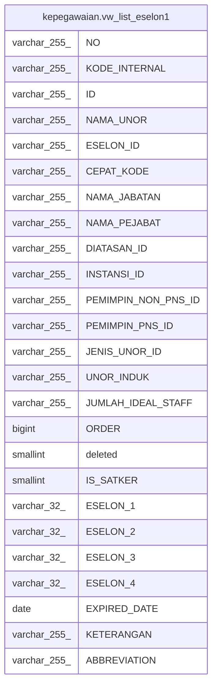

# kepegawaian.vw_list_eselon1

## Description

<details>
<summary><strong>Table Definition</strong></summary>

```sql
CREATE VIEW vw_list_eselon1 AS (
 SELECT DISTINCT "NO",
    "KODE_INTERNAL",
    "ID",
    "NAMA_UNOR",
    "ESELON_ID",
    "CEPAT_KODE",
    "NAMA_JABATAN",
    "NAMA_PEJABAT",
    "DIATASAN_ID",
    "INSTANSI_ID",
    "PEMIMPIN_NON_PNS_ID",
    "PEMIMPIN_PNS_ID",
    "JENIS_UNOR_ID",
    "UNOR_INDUK",
    "JUMLAH_IDEAL_STAFF",
    "ORDER",
    deleted,
    "IS_SATKER",
    "ESELON_1",
    "ESELON_2",
    "ESELON_3",
    "ESELON_4",
    "EXPIRED_DATE",
    "KETERANGAN",
    "ABBREVIATION"
   FROM kepegawaian.unitkerja es1
  WHERE (("ID" IS NOT NULL) AND (("DIATASAN_ID")::text = 'A8ACA7397AEB3912E040640A040269BB'::text) AND ("EXPIRED_DATE" IS NULL))
  ORDER BY "NAMA_UNOR"
)
```

</details>

## Columns

| Name | Type | Default | Nullable | Children | Parents | Comment |
| ---- | ---- | ------- | -------- | -------- | ------- | ------- |
| NO | varchar(255) |  | true |  |  |  |
| KODE_INTERNAL | varchar(255) |  | true |  |  |  |
| ID | varchar(255) |  | true |  |  |  |
| NAMA_UNOR | varchar(255) |  | true |  |  |  |
| ESELON_ID | varchar(255) |  | true |  |  |  |
| CEPAT_KODE | varchar(255) |  | true |  |  |  |
| NAMA_JABATAN | varchar(255) |  | true |  |  |  |
| NAMA_PEJABAT | varchar(255) |  | true |  |  |  |
| DIATASAN_ID | varchar(255) |  | true |  |  |  |
| INSTANSI_ID | varchar(255) |  | true |  |  |  |
| PEMIMPIN_NON_PNS_ID | varchar(255) |  | true |  |  |  |
| PEMIMPIN_PNS_ID | varchar(255) |  | true |  |  |  |
| JENIS_UNOR_ID | varchar(255) |  | true |  |  |  |
| UNOR_INDUK | varchar(255) |  | true |  |  |  |
| JUMLAH_IDEAL_STAFF | varchar(255) |  | true |  |  |  |
| ORDER | bigint |  | true |  |  |  |
| deleted | smallint |  | true |  |  |  |
| IS_SATKER | smallint |  | true |  |  |  |
| ESELON_1 | varchar(32) |  | true |  |  |  |
| ESELON_2 | varchar(32) |  | true |  |  |  |
| ESELON_3 | varchar(32) |  | true |  |  |  |
| ESELON_4 | varchar(32) |  | true |  |  |  |
| EXPIRED_DATE | date |  | true |  |  |  |
| KETERANGAN | varchar(255) |  | true |  |  |  |
| ABBREVIATION | varchar(255) |  | true |  |  |  |

## Referenced Tables

| Name | Columns | Comment | Type |
| ---- | ------- | ------- | ---- |
| [kepegawaian.unitkerja](kepegawaian.unitkerja.md) | 30 |  | BASE TABLE |

## Relations



---

> Generated by [tbls](https://github.com/k1LoW/tbls)
