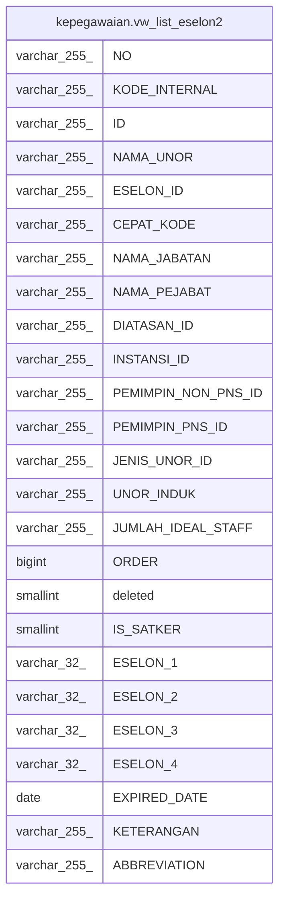

# kepegawaian.vw_list_eselon2

## Description

<details>
<summary><strong>Table Definition</strong></summary>

```sql
CREATE VIEW vw_list_eselon2 AS (
 SELECT DISTINCT es2."NO",
    es2."KODE_INTERNAL",
    es2."ID",
    es2."NAMA_UNOR",
    es2."ESELON_ID",
    es2."CEPAT_KODE",
    es2."NAMA_JABATAN",
    es2."NAMA_PEJABAT",
    es2."DIATASAN_ID",
    es2."INSTANSI_ID",
    es2."PEMIMPIN_NON_PNS_ID",
    es2."PEMIMPIN_PNS_ID",
    es2."JENIS_UNOR_ID",
    es2."UNOR_INDUK",
    es2."JUMLAH_IDEAL_STAFF",
    es2."ORDER",
    es2.deleted,
    es2."IS_SATKER",
    es2."ESELON_1",
    es2."ESELON_2",
    es2."ESELON_3",
    es2."ESELON_4",
    es2."EXPIRED_DATE",
    es2."KETERANGAN",
    es2."ABBREVIATION"
   FROM (kepegawaian.unitkerja uk
     LEFT JOIN kepegawaian.unitkerja es2 ON (((uk."ESELON_2")::text = (es2."ID")::text)))
  WHERE (es2."ID" IS NOT NULL)
  ORDER BY es2."NAMA_UNOR"
)
```

</details>

## Columns

| Name | Type | Default | Nullable | Children | Parents | Comment |
| ---- | ---- | ------- | -------- | -------- | ------- | ------- |
| NO | varchar(255) |  | true |  |  |  |
| KODE_INTERNAL | varchar(255) |  | true |  |  |  |
| ID | varchar(255) |  | true |  |  |  |
| NAMA_UNOR | varchar(255) |  | true |  |  |  |
| ESELON_ID | varchar(255) |  | true |  |  |  |
| CEPAT_KODE | varchar(255) |  | true |  |  |  |
| NAMA_JABATAN | varchar(255) |  | true |  |  |  |
| NAMA_PEJABAT | varchar(255) |  | true |  |  |  |
| DIATASAN_ID | varchar(255) |  | true |  |  |  |
| INSTANSI_ID | varchar(255) |  | true |  |  |  |
| PEMIMPIN_NON_PNS_ID | varchar(255) |  | true |  |  |  |
| PEMIMPIN_PNS_ID | varchar(255) |  | true |  |  |  |
| JENIS_UNOR_ID | varchar(255) |  | true |  |  |  |
| UNOR_INDUK | varchar(255) |  | true |  |  |  |
| JUMLAH_IDEAL_STAFF | varchar(255) |  | true |  |  |  |
| ORDER | bigint |  | true |  |  |  |
| deleted | smallint |  | true |  |  |  |
| IS_SATKER | smallint |  | true |  |  |  |
| ESELON_1 | varchar(32) |  | true |  |  |  |
| ESELON_2 | varchar(32) |  | true |  |  |  |
| ESELON_3 | varchar(32) |  | true |  |  |  |
| ESELON_4 | varchar(32) |  | true |  |  |  |
| EXPIRED_DATE | date |  | true |  |  |  |
| KETERANGAN | varchar(255) |  | true |  |  |  |
| ABBREVIATION | varchar(255) |  | true |  |  |  |

## Referenced Tables

| Name | Columns | Comment | Type |
| ---- | ------- | ------- | ---- |
| [kepegawaian.unitkerja](kepegawaian.unitkerja.md) | 30 |  | BASE TABLE |

## Relations



---

> Generated by [tbls](https://github.com/k1LoW/tbls)
