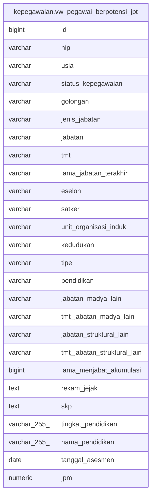

# kepegawaian.vw_pegawai_berpotensi_jpt

## Description

<details>
<summary><strong>Table Definition</strong></summary>

```sql
CREATE VIEW vw_pegawai_berpotensi_jpt AS (
 SELECT apbt.id,
    apbt.nip,
    apbt.usia,
    apbt.status_kepegawaian,
    apbt.golongan,
    apbt.jenis_jabatan,
    apbt.jabatan,
    apbt.tmt,
    apbt.lama_jabatan_terakhir,
    apbt.eselon,
    apbt.satker,
    apbt.unit_organisasi_induk,
    apbt.kedudukan,
    apbt.tipe,
    apbt.pendidikan,
    apbt.jabatan_madya_lain,
    apbt.tmt_jabatan_madya_lain,
    apbt.jabatan_struktural_lain,
    apbt.tmt_jabatan_struktural_lain,
    apbt.lama_menjabat_akumulasi,
    apbt.rekam_jejak,
    apbt.skp,
    tp."NAMA" AS tingkat_pendidikan,
    pd."NAMA" AS nama_pendidikan,
    aha.tanggal_asesmen,
    aha.jpm
   FROM ((((kepegawaian.asesmen_pegawai_berpotensi_jpt apbt
     LEFT JOIN kepegawaian.asesmen_hasil_asesmen aha ON ((btrim((apbt.nip)::text) = btrim((aha.nip)::text))))
     LEFT JOIN kepegawaian.pegawai p ON (((p."NIP_BARU")::text = (apbt.nip)::text)))
     LEFT JOIN kepegawaian.pendidikan pd ON (((p."PENDIDIKAN_ID")::text = (pd."ID")::text)))
     LEFT JOIN kepegawaian.tkpendidikan tp ON (((tp."ID")::text = (pd."TINGKAT_PENDIDIKAN_ID")::text)))
)
```

</details>

## Columns

| Name | Type | Default | Nullable | Children | Parents | Comment |
| ---- | ---- | ------- | -------- | -------- | ------- | ------- |
| id | bigint |  | true |  |  |  |
| nip | varchar |  | true |  |  |  |
| usia | varchar |  | true |  |  |  |
| status_kepegawaian | varchar |  | true |  |  |  |
| golongan | varchar |  | true |  |  |  |
| jenis_jabatan | varchar |  | true |  |  |  |
| jabatan | varchar |  | true |  |  |  |
| tmt | varchar |  | true |  |  |  |
| lama_jabatan_terakhir | varchar |  | true |  |  |  |
| eselon | varchar |  | true |  |  |  |
| satker | varchar |  | true |  |  |  |
| unit_organisasi_induk | varchar |  | true |  |  |  |
| kedudukan | varchar |  | true |  |  |  |
| tipe | varchar |  | true |  |  |  |
| pendidikan | varchar |  | true |  |  |  |
| jabatan_madya_lain | varchar |  | true |  |  |  |
| tmt_jabatan_madya_lain | varchar |  | true |  |  |  |
| jabatan_struktural_lain | varchar |  | true |  |  |  |
| tmt_jabatan_struktural_lain | varchar |  | true |  |  |  |
| lama_menjabat_akumulasi | bigint |  | true |  |  |  |
| rekam_jejak | text |  | true |  |  |  |
| skp | text |  | true |  |  |  |
| tingkat_pendidikan | varchar(255) |  | true |  |  |  |
| nama_pendidikan | varchar(255) |  | true |  |  |  |
| tanggal_asesmen | date |  | true |  |  |  |
| jpm | numeric |  | true |  |  |  |

## Referenced Tables

| Name | Columns | Comment | Type |
| ---- | ------- | ------- | ---- |
| [kepegawaian.asesmen_pegawai_berpotensi_jpt](kepegawaian.asesmen_pegawai_berpotensi_jpt.md) | 26 |  | BASE TABLE |
| [kepegawaian.asesmen_hasil_asesmen](kepegawaian.asesmen_hasil_asesmen.md) | 15 |  | BASE TABLE |
| [kepegawaian.pegawai](kepegawaian.pegawai.md) | 100 |  | BASE TABLE |
| [kepegawaian.pendidikan](kepegawaian.pendidikan.md) | 4 |  | BASE TABLE |
| [kepegawaian.tkpendidikan](kepegawaian.tkpendidikan.md) | 7 |  | BASE TABLE |

## Relations



---

> Generated by [tbls](https://github.com/k1LoW/tbls)
