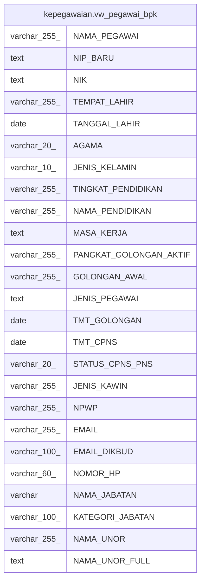

# kepegawaian.vw_pegawai_bpk

## Description

<details>
<summary><strong>Table Definition</strong></summary>

```sql
CREATE VIEW vw_pegawai_bpk AS (
 SELECT pegawai."NAMA" AS "NAMA_PEGAWAI",
    (''''::text || (pegawai."NIP_BARU")::text) AS "NIP_BARU",
    (''''::text || (pegawai."NIK")::text) AS "NIK",
    lokasi."NAMA" AS "TEMPAT_LAHIR",
    pegawai."TGL_LAHIR" AS "TANGGAL_LAHIR",
    agama."NAMA" AS "AGAMA",
    pegawai."JENIS_KELAMIN",
    tkpendidikan."NAMA" AS "TINGKAT_PENDIDIKAN",
    pendidikan."NAMA" AS "NAMA_PENDIDIKAN",
    (((pegawai."MK_TAHUN")::text || '/'::text) || (pegawai."MK_BULAN")::text) AS "MASA_KERJA",
    golongan."NAMA" AS "PANGKAT_GOLONGAN_AKTIF",
    golongan_awal."NAMA" AS "GOLONGAN_AWAL",
    'PNS PUSAT'::text AS "JENIS_PEGAWAI",
    pegawai."TMT_GOLONGAN",
    pegawai."TMT_CPNS",
    pegawai."STATUS_CPNS_PNS",
    jenis_kawin."NAMA" AS "JENIS_KAWIN",
    pegawai."NPWP",
    pegawai."EMAIL",
    pegawai."EMAIL_DIKBUD",
    pegawai."NOMOR_HP",
    jabatan."NAMA_JABATAN",
    jabatan."KATEGORI_JABATAN",
    vw."NAMA_UNOR",
    vw."NAMA_UNOR_FULL"
   FROM ((((((((((kepegawaian.pegawai pegawai
     LEFT JOIN kepegawaian.vw_unit_list vw ON (((pegawai."UNOR_ID")::text = (vw."ID")::text)))
     LEFT JOIN kepegawaian.pns_aktif pa ON ((pegawai."ID" = pa."ID")))
     LEFT JOIN kepegawaian.jabatan ON ((pegawai."JABATAN_INSTANSI_ID" = (jabatan."KODE_JABATAN")::bpchar)))
     LEFT JOIN kepegawaian.lokasi ON (((pegawai."TEMPAT_LAHIR_ID")::text = (lokasi."ID")::text)))
     LEFT JOIN kepegawaian.agama ON ((pegawai."AGAMA_ID" = agama."ID")))
     LEFT JOIN kepegawaian.tkpendidikan ON ((pegawai."TK_PENDIDIKAN" = (tkpendidikan."ID")::bpchar)))
     LEFT JOIN kepegawaian.pendidikan ON (((pegawai."PENDIDIKAN_ID")::text = (pendidikan."ID")::text)))
     LEFT JOIN kepegawaian.golongan ON ((pegawai."GOL_ID" = golongan."ID")))
     LEFT JOIN kepegawaian.golongan golongan_awal ON (((pegawai."GOL_AWAL_ID")::text = (golongan_awal."ID")::text)))
     LEFT JOIN kepegawaian.jenis_kawin ON (((jenis_kawin."ID")::text = (pegawai."JENIS_KAWIN_ID")::text)))
  WHERE ((pa."ID" IS NOT NULL) AND ((pegawai."KEDUDUKAN_HUKUM_ID")::text <> ALL (ARRAY[('14'::character varying)::text, ('52'::character varying)::text, ('66'::character varying)::text, ('67'::character varying)::text, ('77'::character varying)::text, ('88'::character varying)::text, ('98'::character varying)::text, ('99'::character varying)::text, ('100'::character varying)::text])) AND ((pegawai.status_pegawai <> 3) OR (pegawai.status_pegawai IS NULL)))
)
```

</details>

## Columns

| Name | Type | Default | Nullable | Children | Parents | Comment |
| ---- | ---- | ------- | -------- | -------- | ------- | ------- |
| NAMA_PEGAWAI | varchar(255) |  | true |  |  |  |
| NIP_BARU | text |  | true |  |  |  |
| NIK | text |  | true |  |  |  |
| TEMPAT_LAHIR | varchar(255) |  | true |  |  |  |
| TANGGAL_LAHIR | date |  | true |  |  |  |
| AGAMA | varchar(20) |  | true |  |  |  |
| JENIS_KELAMIN | varchar(10) |  | true |  |  |  |
| TINGKAT_PENDIDIKAN | varchar(255) |  | true |  |  |  |
| NAMA_PENDIDIKAN | varchar(255) |  | true |  |  |  |
| MASA_KERJA | text |  | true |  |  |  |
| PANGKAT_GOLONGAN_AKTIF | varchar(255) |  | true |  |  |  |
| GOLONGAN_AWAL | varchar(255) |  | true |  |  |  |
| JENIS_PEGAWAI | text |  | true |  |  |  |
| TMT_GOLONGAN | date |  | true |  |  |  |
| TMT_CPNS | date |  | true |  |  |  |
| STATUS_CPNS_PNS | varchar(20) |  | true |  |  |  |
| JENIS_KAWIN | varchar(255) |  | true |  |  |  |
| NPWP | varchar(255) |  | true |  |  |  |
| EMAIL | varchar(255) |  | true |  |  |  |
| EMAIL_DIKBUD | varchar(100) |  | true |  |  |  |
| NOMOR_HP | varchar(60) |  | true |  |  |  |
| NAMA_JABATAN | varchar |  | true |  |  |  |
| KATEGORI_JABATAN | varchar(100) |  | true |  |  |  |
| NAMA_UNOR | varchar(255) |  | true |  |  |  |
| NAMA_UNOR_FULL | text |  | true |  |  |  |

## Referenced Tables

| Name | Columns | Comment | Type |
| ---- | ------- | ------- | ---- |
| [kepegawaian.pegawai](kepegawaian.pegawai.md) | 100 |  | BASE TABLE |
| [kepegawaian.vw_unit_list](kepegawaian.vw_unit_list.md) | 30 |  | MATERIALIZED VIEW |
| [kepegawaian.pns_aktif](kepegawaian.pns_aktif.md) | 3 |  | VIEW |
| [kepegawaian.jabatan](kepegawaian.jabatan.md) | 12 |  | BASE TABLE |
| [kepegawaian.lokasi](kepegawaian.lokasi.md) | 8 |  | BASE TABLE |
| [kepegawaian.agama](kepegawaian.agama.md) | 4 |  | BASE TABLE |
| [kepegawaian.tkpendidikan](kepegawaian.tkpendidikan.md) | 7 |  | BASE TABLE |
| [kepegawaian.pendidikan](kepegawaian.pendidikan.md) | 4 |  | BASE TABLE |
| [kepegawaian.golongan](kepegawaian.golongan.md) | 6 |  | BASE TABLE |
| [kepegawaian.jenis_kawin](kepegawaian.jenis_kawin.md) | 2 |  | BASE TABLE |

## Relations



---

> Generated by [tbls](https://github.com/k1LoW/tbls)
