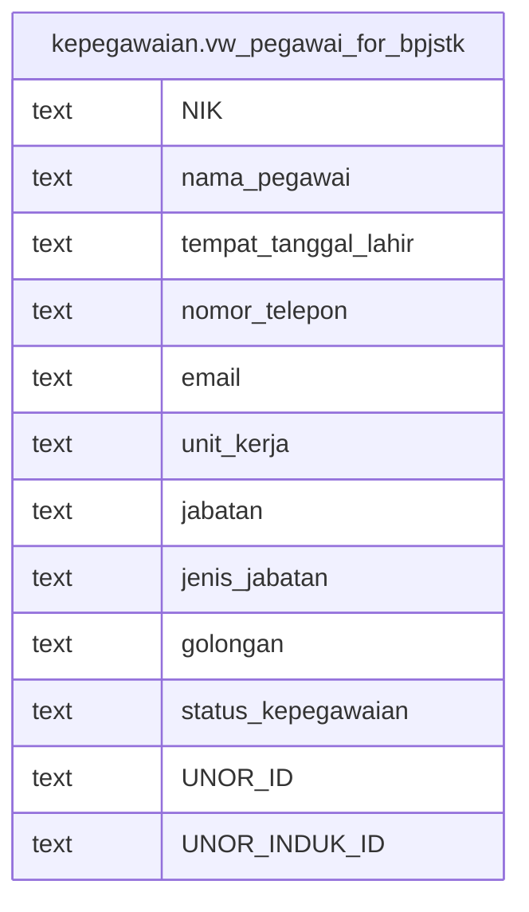

# kepegawaian.vw_pegawai_for_bpjstk

## Description

<details>
<summary><strong>Table Definition</strong></summary>

```sql
CREATE VIEW vw_pegawai_for_bpjstk AS (
 SELECT mvp."NIK",
    mvp."NAMA" AS nama_pegawai,
    (((l."NAMA")::text || ' / '::text) || mvp."TGL_LAHIR") AS tempat_tanggal_lahir,
    mvp."NOMOR_HP" AS nomor_telepon,
    mvp."EMAIL" AS email,
    mvp."NAMA_UNOR_FULL" AS unit_kerja,
    mvp."NAMA_JABATAN_REAL" AS jabatan,
    mvp."KATEGORI_JABATAN_REAL" AS jenis_jabatan,
    mvp."NAMA_GOLONGAN" AS golongan,
        CASE
            WHEN ((mvp."JENIS_PEGAWAI_ID" = '71'::text) OR (mvp."JENIS_PEGAWAI_ID" = '72'::text) OR (mvp."JENIS_PEGAWAI_ID" = '73'::text)) THEN 'PPPK'::text
            ELSE 'PNS'::text
        END AS status_kepegawaian,
    mvp."UNOR_ID",
    mvp."UNOR_INDUK_ID"
   FROM (kepegawaian.mv_pegawai mvp
     LEFT JOIN kepegawaian.lokasi l ON ((mvp."TEMPAT_LAHIR_ID" = (l."ID")::text)))
)
```

</details>

## Columns

| Name | Type | Default | Nullable | Children | Parents | Comment |
| ---- | ---- | ------- | -------- | -------- | ------- | ------- |
| NIK | text |  | true |  |  |  |
| nama_pegawai | text |  | true |  |  |  |
| tempat_tanggal_lahir | text |  | true |  |  |  |
| nomor_telepon | text |  | true |  |  |  |
| email | text |  | true |  |  |  |
| unit_kerja | text |  | true |  |  |  |
| jabatan | text |  | true |  |  |  |
| jenis_jabatan | text |  | true |  |  |  |
| golongan | text |  | true |  |  |  |
| status_kepegawaian | text |  | true |  |  |  |
| UNOR_ID | text |  | true |  |  |  |
| UNOR_INDUK_ID | text |  | true |  |  |  |

## Referenced Tables

| Name | Columns | Comment | Type |
| ---- | ------- | ------- | ---- |
| [kepegawaian.mv_pegawai](kepegawaian.mv_pegawai.md) | 109 |  | MATERIALIZED VIEW |
| [kepegawaian.lokasi](kepegawaian.lokasi.md) | 8 |  | BASE TABLE |

## Relations



---

> Generated by [tbls](https://github.com/k1LoW/tbls)
