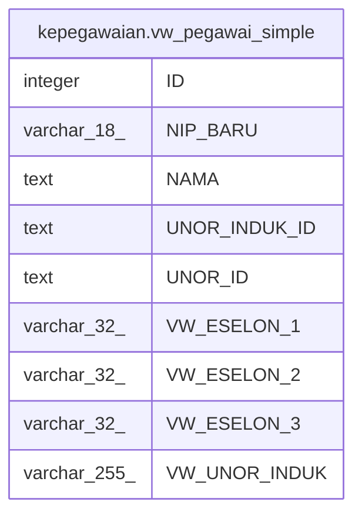

# kepegawaian.vw_pegawai_simple

## Description

<details>
<summary><strong>Table Definition</strong></summary>

```sql
CREATE VIEW vw_pegawai_simple AS (
 SELECT pegawai."ID",
    pegawai."NIP_BARU",
    btrim((pegawai."NAMA")::text) AS "NAMA",
    btrim((pegawai."UNOR_INDUK_ID")::text) AS "UNOR_INDUK_ID",
    btrim((pegawai."UNOR_ID")::text) AS "UNOR_ID",
    vw."ESELON_1" AS "VW_ESELON_1",
    vw."ESELON_2" AS "VW_ESELON_2",
    vw."ESELON_3" AS "VW_ESELON_3",
    vw."UNOR_INDUK" AS "VW_UNOR_INDUK"
   FROM ((kepegawaian.pegawai pegawai
     LEFT JOIN kepegawaian.vw_unit_list vw ON (((pegawai."UNOR_ID")::text = (vw."ID")::text)))
     LEFT JOIN kepegawaian.pns_aktif pa ON ((pegawai."ID" = pa."ID")))
  WHERE ((pa."ID" IS NOT NULL) AND ((pegawai."KEDUDUKAN_HUKUM_ID")::text <> '99'::text) AND ((pegawai."KEDUDUKAN_HUKUM_ID")::text <> '66'::text) AND ((pegawai."KEDUDUKAN_HUKUM_ID")::text <> '52'::text) AND ((pegawai."KEDUDUKAN_HUKUM_ID")::text <> '20'::text) AND ((pegawai."KEDUDUKAN_HUKUM_ID")::text <> '04'::text) AND ((pegawai.status_pegawai <> 3) OR (pegawai.status_pegawai IS NULL)))
)
```

</details>

## Columns

| Name | Type | Default | Nullable | Children | Parents | Comment |
| ---- | ---- | ------- | -------- | -------- | ------- | ------- |
| ID | integer |  | true |  |  |  |
| NIP_BARU | varchar(18) |  | true |  |  |  |
| NAMA | text |  | true |  |  |  |
| UNOR_INDUK_ID | text |  | true |  |  |  |
| UNOR_ID | text |  | true |  |  |  |
| VW_ESELON_1 | varchar(32) |  | true |  |  |  |
| VW_ESELON_2 | varchar(32) |  | true |  |  |  |
| VW_ESELON_3 | varchar(32) |  | true |  |  |  |
| VW_UNOR_INDUK | varchar(255) |  | true |  |  |  |

## Referenced Tables

| Name | Columns | Comment | Type |
| ---- | ------- | ------- | ---- |
| [kepegawaian.pegawai](kepegawaian.pegawai.md) | 100 |  | BASE TABLE |
| [kepegawaian.vw_unit_list](kepegawaian.vw_unit_list.md) | 30 |  | MATERIALIZED VIEW |
| [kepegawaian.pns_aktif](kepegawaian.pns_aktif.md) | 3 |  | VIEW |

## Relations



---

> Generated by [tbls](https://github.com/k1LoW/tbls)
